MTSchmitz

Plotting Favorite Genes Along a Multi-Condition Time Series
===========================================================

### Loading Gene Lists

Lists of your favorite genes might come from any number of sources. You can see how to make one based upon GO term annotation in the QueryingGO tutorial. You can also enter them in a column in excel and save the file as a tab delimited text file.

Here we load THEneuralList\_2017.txt, which can be found in the Data directory of this repository. **Don't forget to replace the path with the correct location of the file on your own computer!** If you put this repository in the ~/code/ directory where I told you to, you shouldn't have to worry :)

The function unique() removes any duplicates in the list, and toupper is necessary because if you're comparing mouse and human gene names, you won't be able to match them if they aren't the same case. Just to note, the neuralList is not a list in the R data structure sense (it's a vector of character strings).

``` r
pathToList <- "~/code/GhostOfMT/Data/GeneLists/THEneuralList_2017.txt"
#NOTE THE PARAMETERS
rawList <- read.csv2(file=pathToList,header = F,sep = "\t",stringsAsFactors = F)
neuralList <- unique(toupper(rawList[,1]))
print(neuralList)
```

    ##   [1] "PAX6"    "SOX1"    "OTX1"    "OTX2"    "LHX2"    "DLK1"    "EMX2"   
    ##   [8] "IRX3"    "ASCL1"   "TBR1"    "TBR2"    "FOXG1"   "CUX1"    "POU3F2" 
    ##  [15] "BCL11B"  "SOX2"    "RELN"    "EOMES"   "SATB2"   "TUBB3"   "MAP1B"  
    ##  [22] "MAP2"    "DCX"     "VIM"     "NES"     "STMN2"   "GLI1"    "GLI2"   
    ##  [29] "GLI3"    "MEIS1"   "MEIS2"   "GNG2"    "INSM1"   "MYT1L"   "NCAM1"  
    ##  [36] "ELAVL4"  "NEFL"    "NHLH2"   "SPOCK2"  "RCAN2"   "GAP43"   "NEUROD1"
    ##  [43] "NEUROD2" "NEUROD4" "NEUROD6" "NEUROG1" "NEUROG2" "OLIG2"   "FABP7"  
    ##  [50] "GFAP"    "HES1"    "HES6"    "SLC1A3"  "GABBR1"  "GABARAP" "GAD1"   
    ##  [57] "SYT1"    "SYT4"    "SYT11"   "SNAP25"  "SLC17A6" "SLC18A1" "SLC18A2"
    ##  [64] "GRIA1"   "GRIA2"   "NOG"     "SHH"     "DBH"     "ISL1 "   "TH"     
    ##  [71] "FOXA1"   "FOXA2"   "NKX2-1"  "NKX2-2"  "NKX6-1"  "NK6-2"   "MNX1"   
    ##  [78] "CHAT"    "DDC"     "PAX7"    "LMX1A"   "LMX1B"   "PHOX2A"  "PHOX2B" 
    ##  [85] "CORIN"   "POU5F1"  "NANOG"   "HOXA1"   "HOXA10"  "HOXA11"  "HOXA13" 
    ##  [92] "HOXA2"   "HOXA3"   "HOXA4"   "HOXA5"   "HOXA6"   "HOXA7"   "HOXA9"  
    ##  [99] "HOXB1"   "HOXB13"  "HOXB2"   "HOXB3"   "HOXB4"   "HOXB5"   "HOXB6"  
    ## [106] "HOXB7"   "HOXB8"   "HOXB9"   "HOXC10"  "HOXC11"  "HOXC12"  "HOXC13" 
    ## [113] "HOXC4"   "HOXC5"   "HOXC6"   "HOXC8"   "HOXC9"   "HOXD1"   "HOXD10" 
    ## [120] "HOXD11"  "HOXD12"  "HOXD13"  "HOXD3"   "HOXD4"   "HOXD8"   "HOXD9"

### Loading RNAseq Data files

You should see the beginning of the tutorial for BasicRNAseq if you want more info on loading unnormalized counts files, or to install packages you're missing.

``` r
#load the packages you'll need:
#for normalizing
library(EBSeq)
#for changing view layout
library(rafalib)
#for the color palette
library(RColorBrewer)
#for fancy plots
library(gplots)
library(ggplot2)
```

Once we have those packages loaded, we can load up the RNAseq file, which you can download from the Data folder in this Github Repo. This file is TPMs, which are normalized by both the number of reads, and the length of each transcript (in number of base pairs). Because TPMs are normalized by length of transcript by RSEM, you can't compare them to "normalized counts".

Reminder: In Rstudio typing a ? in front of a function or package you don't understand pulls up the help documents.

``` r
pathToFile <- "~/code/GhostOfMT/Data/GSE90053_H1_TPM.txt"
#NOTE THE PARAMETERS
hTPMs <- read.csv2(file=pathToFile,header = T,row.names = 1,sep = "\t")
#hTPMs <- hTPMs[,-ncol(hTPMs)] #uncomment this line if the last column is gene name description text (or modify it if it is a different column)
#It removes the last column of the data from the data set
hTPMs <- as.matrix(hTPMs)
storage.mode(hTPMs) <- "numeric"
rownames(hTPMs) <- toupper(rownames(hTPMs))

pathToFileM <- "~/code/GhostOfMT/Data/GSE90053_mEpi_TPM.txt"
#NOTE THE PARAMETERS
mTPMs <- read.csv2(file=pathToFileM,header = T,row.names = 1,sep = "\t")
#mTPMS <- mTPMs[,-ncol(mTPMs)] #uncomment this line if the last column is gene name description text (or modify it if it is a different column)
#It removes the last column of the data from the data set
mTPMs <- as.matrix(mTPMs)
storage.mode(mTPMs) <- "numeric"
rownames(mTPMs) <- toupper(rownames(mTPMs))
```

You can check that you're dealing with TPMs, because each column should sum to 1,000,000 (slightly off due to mystery rounding error)

``` r
colSums(hTPMs)
```

    ##  H1Rosa7_d0  H1Rosa7_d1  H1Rosa7_d2  H1Rosa7_d3  H1Rosa7_d4  H1Rosa7_d5 
    ##   1000000.0   1000000.6   1000000.0   1000000.8   1000000.4   1000000.1 
    ##  H1Rosa7_d6  H1Rosa7_d7  H1Rosa7_d8 H1Rosa7_d10 H1Rosa7_d12 H1Rosa7_d14 
    ##   1000000.3   1000000.2   1000000.1    999999.6    999999.7   1000000.0 
    ## H1Rosa7_d16 H1Rosa7_d18 H1Rosa7_d20 H1Rosa7_d21 H1Rosa7_d22 H1Rosa7_d24 
    ##    999999.4   1000000.3   1000000.7   1000000.2    999999.2    999999.2 
    ## H1Rosa7_d26 H1Rosa7_d30 H1Rosa7_d32 H1Rosa7_d34 H1Rosa7_d36 H1Rosa7_d38 
    ##   1000000.6    999999.6   1000000.0    999999.9    999999.5   1000000.4 
    ## H1Rosa7_d40 H1Rosa7_d42 
    ##   1000000.3    999999.7

See the BasicRNAseq tutorial for more explanation on this parsing colnames to get timepoints

``` r
splitList <- strsplit(x = colnames(hTPMs),split = "_d")
splitMatrix <- sapply(splitList, "[", 1:max(sapply(splitList,length)) )
tpsH <- as.numeric(splitMatrix[2,])
conditionsH <- splitMatrix[1,]
splitList <- strsplit(x = colnames(mTPMs),split = "_d")
splitMatrix <- sapply(splitList, "[", 1:max(sapply(splitList,length)) )
tpsM <- as.numeric(splitMatrix[2,])
conditionsM <- gsub("_Sorted","",splitMatrix[1,])
```

If you want to be a smart scripter, instead of copying and pasting the same code twice and slightly modifying it , you can wrap it into a function

``` r
getConditionsFromColnames <- function(data,split="_",ind=1 ){
  splitList <- strsplit(x = colnames(data),split = split)
  splitMatrix <- sapply(splitList, "[", 1:max(sapply(splitList,length)) )
  return(splitMatrix[ind,])
}

tpsH <- as.numeric(getConditionsFromColnames(hTPMs,"_d",2))
conditionsH <- getConditionsFromColnames(hTPMs,"_d",1)
tpsM <- as.numeric(getConditionsFromColnames(mTPMs,"_d",2))
conditionsM <- gsub("_Sorted","",getConditionsFromColnames(mTPMs,"_d",1))
```

Speaking of functions, here is a helpful function that will allow you to stick two matrices together, filling in zeros for genes that are not shared between the two datasets

``` r
rn.merge <- function(x,y,fill=0){
  rn <- intersect(rownames(x),rownames(y))
  zerosx <- setdiff(rownames(x),rownames(y))
  zerosy <- setdiff(rownames(y),rownames(x))
  out <- cbind(x[rn,],y[rn,])
  if(length(zerosx)!=1  &length(zerosy)!=1){
    zx <- matrix(fill, nrow=length(zerosx), ncol =ncol(y), dimnames = list(zerosx,NULL))
    zy <- matrix(fill, nrow=length(zerosy), ncol =ncol(x), dimnames = list(zerosy,NULL))
    zx <- cbind(x[zerosx,],zx)
    zy <- cbind(zy,y[zerosy,])
  }else if(length(zerosx)==1){
    zx <- rep(fill, ncol(y))
    zy <- matrix(fill, nrow=length(zerosy), ncol =ncol(x), dimnames = list(zerosy,NULL))
    zx <- c(x[zerosx,],zx)
    zy <- cbind(zy,y[zerosy,])
  }else if(length(zerosy)==1){
    zx <- matrix(fill, nrow=length(zerosx), ncol =ncol(y), dimnames = list(zerosx,NULL))
    zy <- rep(fill, ncol(x))
    print(zx)
    print(zy)
    zx <- cbind(x[zerosx,],zx)
    zy <- c(zy,y[zerosy,])
  }
  out <- rbind(out,rbind(zx,zy))
  return(out)

}

#This function will allow you to plot just a legend by itself
g_legend<-function(a.gplot){ 
  tmp <- ggplot_gtable(ggplot_build(a.gplot)) 
  leg <- which(sapply(tmp$grobs, function(x) x$name) == "guide-box") 
  legend <- tmp$grobs[[leg]] 
  return(legend)
  } 
```

We have the timepoints (in days) captured as "tps"" and also have renamed the column names of hTPMS to the timepoints, as well as having the other condition group (in this case it is species) in the conditions vectors! We can use the rn.merge function to put all the data together, while concatenating all the conditions and time points.

### Plotting together

``` r
#melt function
library(reshape2)
#for time series analysis
library(zoo)
#for plotting
library(ggplot2)
library(grid)
library(gridExtra)
#You can string together as many datasets as you as you want, just add conditions, TimePoints and TPMs!
conditionsMerged <- c(conditionsH,conditionsM)
tpMerged <- c(tpsH,tpsM)
dataMerged <- Reduce(rn.merge,list(hTPMs,mTPMs))
#global gg graph
ggg <- NULL
gene_list <- neuralList[neuralList%in%rownames(dataMerged)]

if(length(tpMerged)!=length(conditionsMerged))stop("You need to have the same number of conditions and time points")
#loop through all the genes in your list and make a plot for each one
plotlist <- lapply( gene_list,function(gn){
  #Calculate mean values
  dataDF <- lapply(unique(conditionsMerged),function(x){
    data.frame(condit=rep(x, sum(conditionsMerged==x)),tp=tpMerged[conditionsMerged==x],value=dataMerged[gn,conditionsMerged==x])
  })
  #Put that list back into a matrix of the means for the data set, call variable meanMatrix
  finalMatrix <- Reduce(rbind,dataDF)
  #ggplots are formed by addition of various pieces to form one, complicated object gg
  gg <-  ggplot(finalMatrix, aes(x=tp, y=value, group=condit,colour=condit)) + 
    geom_point(size=1) +
    theme_bw(base_size = 6) +
    theme(legend.position="none",
          panel.grid.major = element_blank(),
          panel.grid.minor = element_blank(),
          panel.background = element_blank())+
    labs(x = "Time", y = "Expression", 
         title = gn,family="arial",size=6)
  #Just print gg to display the plot
  gg
  #double assignment <<- means to assign to variable outside of the scope of the loop
  ggg <<- gg
  })
#plot just the legend
#Extract Legend 
legend <- g_legend(ggg+theme(legend.position="left",
          panel.grid.major = element_blank(),
          panel.grid.minor = element_blank(),
          panel.background = element_blank())) 

#Take the list of plots and arrange them into something you can display, 4 plots by 4 plots
marrangeGrob(grobs= c(grid.draw(legend) ,plotlist) , nrow=4, ncol=4,top = NULL)
```

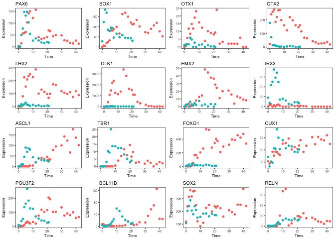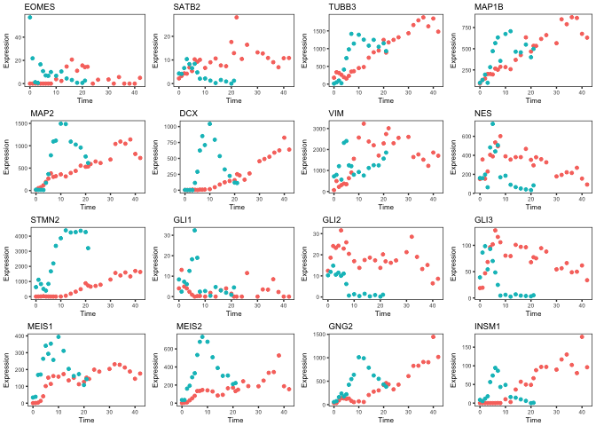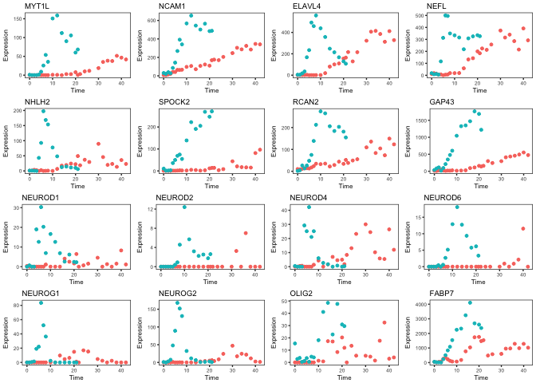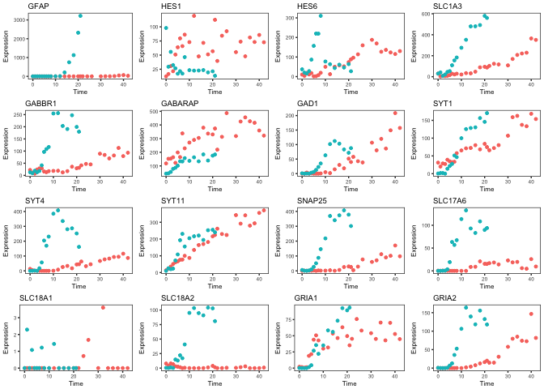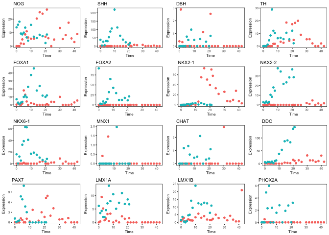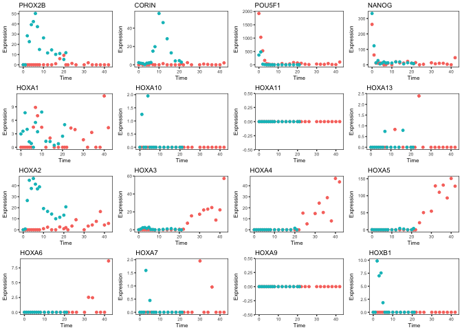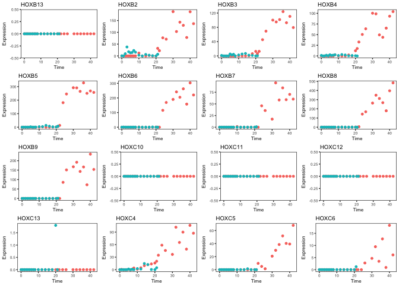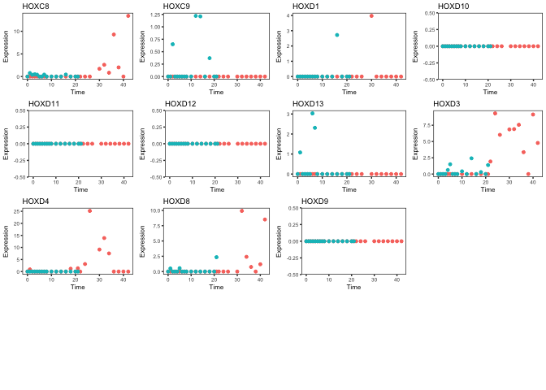

``` r
#output this whole list of plots as a PDF on your desktop
pdf("~/Desktop/ChosenGenes.pdf", onefile = TRUE)
#plot the legend separately
grid.draw(legend) 
#now the rest of the plots
marrangeGrob(grobs=plotlist , nrow=4, ncol=4,top = NULL)
```

``` r
dev.off()
```

    ## quartz_off_screen 
    ##                 2

We can also graph the gene expression over time, averaging replicates and showing standard error (There are no replicates in this time series, but we can pretend there are for one timepoint just to see error bars). Plotting takes a decent amount of resources, so brace yourself if it takes a few minutes of thinking

### Plotting together, averaging timepoints

``` r
#You can string together as many datasets as you as you want!
conditionsMerged <- c(conditionsH,conditionsM)
tpMerged <- c(tpsH,tpsM)
dataMerged <- Reduce(rn.merge,list(hTPMs,mTPMs))
ggg <- NULL

###GET RID OF THESE 3 LINES WHEN DOING REAL ANALYSIS
#pretend that the 3rd through the 5th tps are replicates
tpMerged <- tpMerged[c(1,2,3,3,3,4:length(tpMerged))]
conditionsMerged <- conditionsMerged[c(1,2,3,3,3,4:length(conditionsMerged))]
dataMerged <- dataMerged[,c(1,2,3,4,5,4:ncol(dataMerged))]

gene_list <- neuralList[neuralList%in%rownames(dataMerged)]

if(length(tpMerged)!=length(conditionsMerged))stop("You need to have the same number of conditions and time points")

plotlist <- lapply( gene_list,function(gn){
  #Calculate mean values
  meanGenes <- sapply(unique(conditionsMerged),function(x){
    #get the row for the current gene in the outer loop, with all the samples from condition x
    #take the mean if the timepoint matches
    tst <- aggregate(dataMerged[gn,conditionsMerged==x], list(tpMerged[conditionsMerged==x]), mean)
    zoo(tst[,2],tst[,1])
      })
  #Merge the outputs back int oa matrix
  meanMatrix <- Reduce(merge.zoo,meanGenes)
  #rename columns to the conditions
  colnames(meanMatrix) <- unique(conditionsMerged)
  #convert the matrix to a Data Frame
  meanMatrix <- data.frame(meanMatrix)
  #Make the rownames an actual column of the frame
  meanMatrix <- cbind("tme"=rownames(meanMatrix) , meanMatrix)
  #melt changes the structure of the data so that you it can be fed to ggplot
  melted <-  melt(meanMatrix)
  #calculate standard errors
  seGenes <- sapply(unique(conditionsMerged),function(x){
    tst <- aggregate(dataMerged[gn,conditionsMerged==x], list(tpMerged[conditionsMerged==x]), function(q)sd(q)/sqrt(length(q)))
    zoo(tst[,2],tst[,1])
  })
  
  seGenes <- Reduce(merge.zoo,seGenes)
  colnames(seGenes) <-unique(conditionsMerged)
  seGenes <- as.data.frame(seGenes)
  seGenes <- cbind("tme"=rownames(seGenes) , seGenes)
  meltSE <-  melt(seGenes)
  melted <-  cbind(melted,"se"= meltSE$value)
  melted$tme <- as.numeric(as.character(melted$tme))
  #Plotting Error Bars
  pd <- position_dodge(0.5) # move them .05 to the left and right
  
  gg <-  ggplot(melted, aes(x=tme, y=value, group=variable,color=variable)) + 
    geom_errorbar(aes(ymin=value-se, ymax=value+se), width=.03, position=pd) +
    geom_line(position=pd,size=.4) +
    geom_point(position=pd,size=.8) +
    theme_bw(base_size = 6) +
    theme(legend.position="none",
          panel.grid.major = element_blank(),
          panel.grid.minor = element_blank(),
          panel.background = element_blank())+
  #scale_x_continuous(expand = c(0, 0)) + scale_y_continuous(expand = c(0, 0))+
    labs(x = "Time", y = "Expression", 
         title = gn,family="arial",size=6)
  gg
  ggg<<-gg 
})

legend <- g_legend(ggg+theme(legend.position="left",
          panel.grid.major = element_blank(),
          panel.grid.minor = element_blank(),
          panel.background = element_blank())) 
marrangeGrob(grobs=c(grid.draw(legend),plotlist) , nrow=4, ncol=4,top = NULL)
```

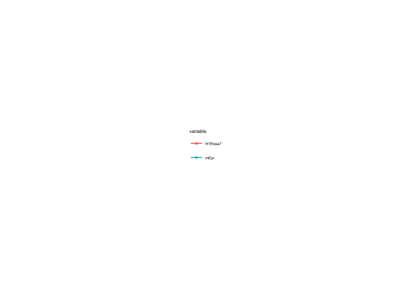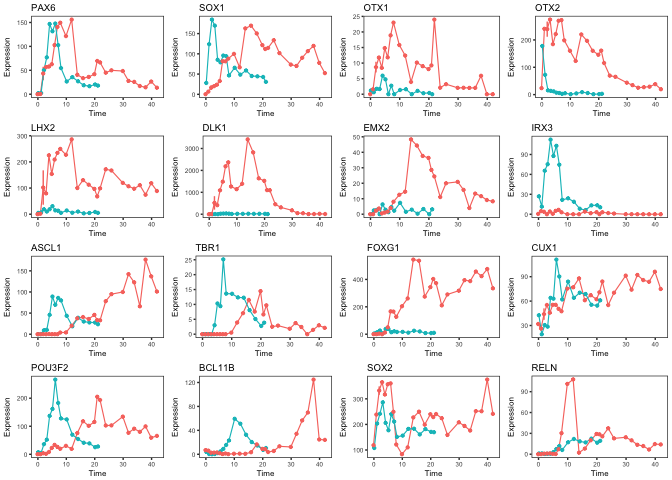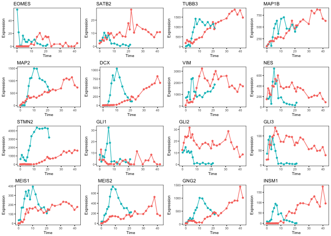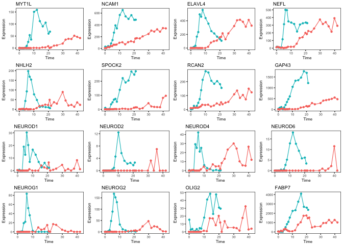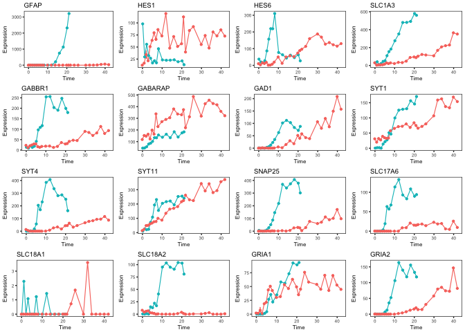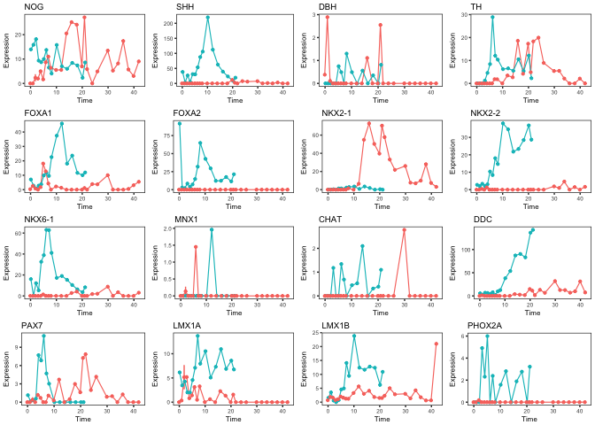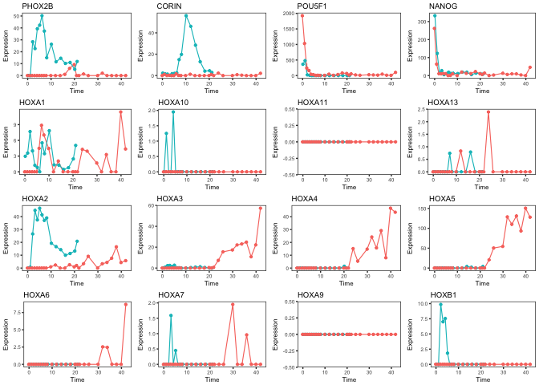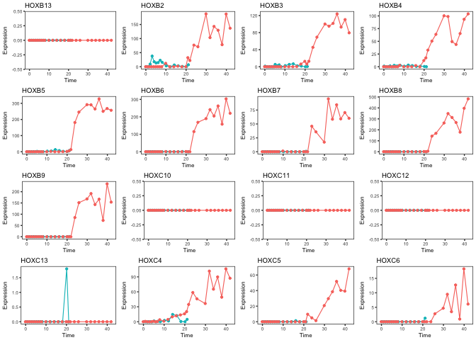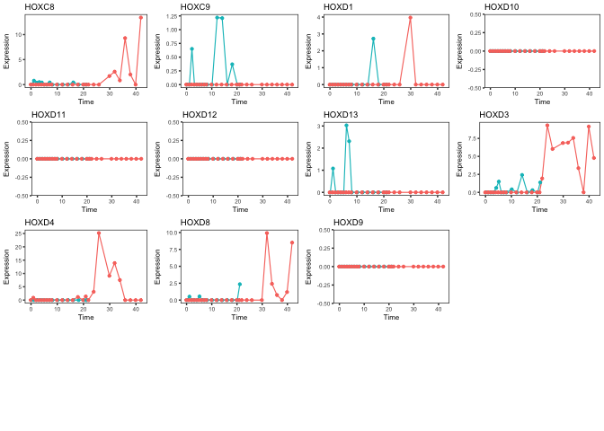

``` r
#output this whole list of plots as a PDF on your desktop
pdf("~/Desktop/ChosenMeanGenes.pdf", onefile = TRUE)
 
marrangeGrob(grobs=c(grid.draw(legend),plotlist) , nrow=4, ncol=4,top = NULL)
```

``` r
dev.off()
```

    ## quartz_off_screen 
    ##                 2

### Into a Function

To make this whole thing a one-liner, we can make it into a function you can load to quickly plot all the genes you love. The parameters should be as follows:

conditionsMerged is a concatenation of your condition sets for each distinct dataset e.g. cM &lt;- c(conditionsH,conditionsM)

tpMerged is a concatenation of your timepoints for each distinct dataset e.g. tM &lt;- c(tpsH,tpsM)

dataMerged is your data matrices for each distinct dataset column binded e.g. dM &lt;- Reduce(rn.merge,list(hTPMs,mTPMs))

gene\_list is a vector of the genes you want to see plotted e.g. gl &lt;- unique(toupper(read.csv2(file=pathToList,header = F,sep = "",stringsAsFactors = F)\[,1\]))

**then call the function like this:**

plotFavoriteGenes(conditionsMerged=cM,tpMerged=tM,dataMerged=dM,gene\_list=gl,meanOfTPs=F, outFile="~/Desktop/BigMix2017\_NeuralList742.pdf" )

``` r
plotFavoriteGenes <- function(conditionsMerged, tpMerged, dataMerged,gene_list, meanOfTPs=T,outFile="~/Desktop/ChosenMeanGenes.pdf"){
  #You can string together as many datasets as you as you want!
  ggg <- NULL

  if(length(tpMerged)!=length(conditionsMerged))stop("You need to have the same number of conditions and time points")
  
  if(meanOfTPs){ 
    plotlist <- lapply( gene_list,function(gn){
      #Calculate mean values
      meanGenes <- sapply(unique(conditionsMerged),function(x){
        #get the row for the current gene in the outer loop, with all the samples from condition x
        #take the mean if the timepoint matches
        tst <- aggregate(dataMerged[gn,conditionsMerged==x], list(tpMerged[conditionsMerged==x]), mean)
        zoo(tst[,2],tst[,1])
          })
      #Merge the outputs back int oa matrix
      meanMatrix <- Reduce(merge.zoo,meanGenes)
      #rename columns to the conditions
      colnames(meanMatrix) <- unique(conditionsMerged)
      #convert the matrix to a Data Frame
      meanMatrix <- data.frame(meanMatrix)
      #Make the rownames an actual column of the frame
      meanMatrix <- cbind("tme"=rownames(meanMatrix) , meanMatrix)
      #melt changes the structure of the data so that you it can be fed to ggplot
      melted <-  melt(meanMatrix)
      #calculate standard errors
      seGenes <- sapply(unique(conditionsMerged),function(x){
        tst <- aggregate(dataMerged[gn,conditionsMerged==x], list(tpMerged[conditionsMerged==x]), function(q)sd(q)/sqrt(length(q)))
        zoo(tst[,2],tst[,1])
      })
      
      seGenes <- Reduce(merge.zoo,seGenes)
      colnames(seGenes) <-unique(conditionsMerged)
      seGenes <- as.data.frame(seGenes)
      seGenes <- cbind("tme"=rownames(seGenes) , seGenes)
      meltSE <-  melt(seGenes)
      melted <-  cbind(melted,"se"= meltSE$value)
      melted$tme <- as.numeric(as.character(melted$tme))
      #Plotting Error Bars
      pd <- position_dodge(0.5) # move them .05 to the left and right
      
      gg <-  ggplot(melted, aes(x=tme, y=value, group=variable,color=variable)) + 
        geom_errorbar(aes(ymin=value-se, ymax=value+se), width=.03, position=pd) +
        geom_line(position=pd,size=.4) +
        geom_point(position=pd,size=.8) +
        theme_bw(base_size = 6) +
        theme(legend.position="none",
              panel.grid.major = element_blank(),
              panel.grid.minor = element_blank(),
              panel.background = element_blank())+
      #scale_x_continuous(expand = c(0, 0)) + scale_y_continuous(expand = c(0, 0))+
        labs(x = "Time", y = "Expression", 
             title = gn,family="arial",size=6)
      gg
      ggg<<-gg 
    })
  }else{
    #loop through all the genes in your list and make a plot for each one
  plotlist <- lapply( gene_list,function(gn){
  #Calculate mean values
  dataDF <- lapply(unique(conditionsMerged),function(x){
    data.frame(condit=rep(x, sum(conditionsMerged==x)),tp=tpMerged[conditionsMerged==x],value=dataMerged[gn,conditionsMerged==x])
  })
  #Put that list back into a matrix of the means for the data set, call variable meanMatrix
  finalMatrix <- Reduce(rbind,dataDF)
  #ggplots are formed by addition of various pieces to form one, complicated object gg
  gg <-  ggplot(finalMatrix, aes(x=tp, y=value, group=condit,colour=condit)) + 
    geom_point(size=1) +
    theme_bw(base_size = 6) +
    theme(legend.position="none",
          panel.grid.major = element_blank(),
          panel.grid.minor = element_blank(),
          panel.background = element_blank())+
    labs(x = "Time", y = "Expression", 
         title = gn,family="arial",size=6)
  #Just print gg to display the plot
  gg
  #double assignment <<- means to assign to variable outside of the scope of the loop
  ggg <<- gg
  })
  }
  
  legend <- g_legend(ggg+theme(legend.position="left",
            panel.grid.major = element_blank(),
            panel.grid.minor = element_blank(),
            panel.background = element_blank())) 

  #output this whole list of plots as a PDF on your desktop
  pdf(file = outFile, onefile = TRUE)
  marrangeGrob(grobs=c(grid.draw(legend),plotlist) , nrow=4, ncol=4,top = NULL)
  dev.off()
}
plotFavoriteGenes(conditionsMerged, tpMerged, dataMerged,gene_list, meanOfTPs=T,outFile="~/Desktop/ChosenMeanGenes.pdf")
```

    ## quartz_off_screen 
    ##                 2
