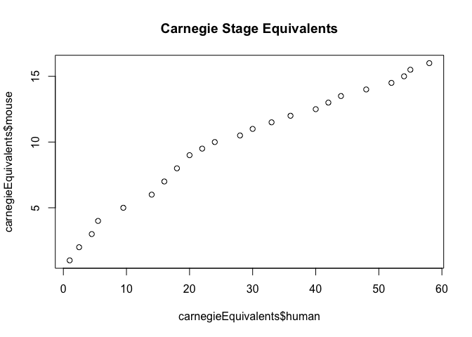

MTSchmitz

Fancy Heatmaps
==============

### How to make Scaled Box, Alternating Color Scheme, and Overlay heatmaps

Instead of continuing to copy and paste the same data loading, we can write the code to load the TPMs and the NeuralList for the mouse and human data (from PlottingFavoriteGenesInTS) in a separate R script and load it in a single line.

``` r
#As always, make sure the path is correct on your computer
source("~/code/GhostOfMT/Tutorials/LoadData.R")
```

Load the packages we need:

``` r
#load the packages you'll need:
#for normalizing
library(EBSeq)
#for changing view layout
library(rafalib)
#for the color palette
library(RColorBrewer)
#for fancy plots
library(gplots)
library(ggplot2)
library(reshape2)
library(ggrepel)
library(matrixStats)
```

So, now we have the data we need:

``` r
print("Mouse Data")
```

    ## [1] "Mouse Data"

``` r
head(mTPMs)
```

    ##               mEpi_Sorted_d0 mEpi_d1 mEpi_d2 mEpi_d3 mEpi_d4 mEpi_d5
    ## 0610007P14RIK          54.94   87.37  141.93  159.91   84.01   64.65
    ## 0610009B22RIK          18.88   30.50   32.50   33.75   37.18   39.70
    ## 0610009D07RIK          75.64   59.97   75.37   78.29   78.10   46.98
    ## 0610009O20RIK          43.13   22.69   23.41   40.10   40.03   35.89
    ## 0610010F05RIK          39.13   39.91   44.82   40.56   60.05   48.33
    ## 0610010K14RIK          49.63   99.91   81.75   98.32   67.65   67.97
    ##               mEpi_d6 mEpi_d7 mEpi_d8 mEpi_d10 mEpi_d12 mEpi_d14 mEpi_d16
    ## 0610007P14RIK   89.98  109.08   76.82   122.07   148.69   133.32   144.78
    ## 0610009B22RIK   47.20   49.20   76.09    52.90    19.54    71.47    43.65
    ## 0610009D07RIK   99.38   72.75  117.92    81.11    68.22    75.63    64.96
    ## 0610009O20RIK   31.29   31.40   39.73    16.25    19.90    29.37    23.07
    ## 0610010F05RIK  101.02  114.33  169.05   176.96   160.52   132.10   102.39
    ## 0610010K14RIK   51.84   74.11  140.87    62.81    53.42    42.16    76.18
    ##               mEpi_d18 mEpi_d20 mEpi_d21
    ## 0610007P14RIK   118.74   103.38    92.54
    ## 0610009B22RIK    36.70    41.76    50.47
    ## 0610009D07RIK    90.04    87.39    49.49
    ## 0610009O20RIK    23.59    33.62    29.96
    ## 0610010F05RIK   112.42    62.76    67.27
    ## 0610010K14RIK    36.01    46.10    65.88

``` r
print("Human data:")
```

    ## [1] "Human data:"

``` r
head(hTPMs)
```

    ##        H1Rosa7_d0 H1Rosa7_d1 H1Rosa7_d2 H1Rosa7_d3 H1Rosa7_d4 H1Rosa7_d5
    ## A1BG         7.22       4.54       6.54       2.84       0.76       8.03
    ## A1CF         0.00       0.00       0.27       0.00       0.00       0.00
    ## A2LD1        0.00       0.43       1.99       4.22       3.53       2.95
    ## A2M          0.00       0.00       0.00       0.00       0.00       0.00
    ## A2ML1        4.07       1.67       1.43       0.97       0.29       0.00
    ## A4GALT       9.63      10.39      14.42      24.50      13.52      14.28
    ##        H1Rosa7_d6 H1Rosa7_d7 H1Rosa7_d8 H1Rosa7_d10 H1Rosa7_d12
    ## A1BG         9.28       2.84       3.12        0.99       13.06
    ## A1CF         0.00       0.09       0.00        0.00        1.68
    ## A2LD1        5.69       0.94       0.82        6.52        4.68
    ## A2M          1.25       0.00       0.00        0.00        0.00
    ## A2ML1        0.20       0.00       0.40        0.00        3.13
    ## A4GALT       3.87       7.96       2.10        0.00        0.00
    ##        H1Rosa7_d14 H1Rosa7_d16 H1Rosa7_d18 H1Rosa7_d20 H1Rosa7_d21
    ## A1BG         10.99        6.96       12.93       25.31       12.04
    ## A1CF          0.10        0.01        0.00        0.00        0.00
    ## A2LD1         0.00        1.15        1.71        3.71        0.00
    ## A2M           3.10        9.49       17.19       29.27       60.39
    ## A2ML1         0.00        0.30        1.45        0.32        0.00
    ## A4GALT        0.00        0.00        0.73        0.00        0.84
    ##        H1Rosa7_d22 H1Rosa7_d24 H1Rosa7_d26 H1Rosa7_d30 H1Rosa7_d32
    ## A1BG          0.00        3.42        6.56       11.12        4.51
    ## A1CF          0.00        0.00        0.25        0.21        0.00
    ## A2LD1         2.49        0.00        0.87        1.47        1.49
    ## A2M          55.83       13.30        9.39        6.69       11.04
    ## A2ML1         0.00        0.00        0.00        0.00        0.84
    ## A4GALT        3.18        0.00        0.00        0.00        0.00
    ##        H1Rosa7_d34 H1Rosa7_d36 H1Rosa7_d38 H1Rosa7_d40 H1Rosa7_d42
    ## A1BG          5.49        8.78        6.13       16.30       15.48
    ## A1CF          0.00        0.00        0.00        0.00        1.33
    ## A2LD1         1.45        2.17        0.00        7.89        0.00
    ## A2M          25.62       27.68       31.62       32.71       50.98
    ## A2ML1         2.91        0.00        0.00        0.00        3.51
    ## A4GALT        0.00        0.00        2.21        0.00        0.00

``` r
print("Neural List:")
```

    ## [1] "Neural List:"

``` r
head(neuralList)
```

    ## [1] "PAX6" "SOX1" "OTX1" "OTX2" "LHX2" "DLK1"

The first thing we're going to do is see how the mouse samples correlate with the human data. Because we're looking at two different species it is best practice to include only those genes which are actually orthologs. For simplicity's sake though, we're going to assume that the same gene name in mouse and human means that they are the homologs we should be comparing (this is true for for most cases). The

``` r
#Take two matrices, return two matrices with matching rownames
rn.compare <- function(x,y,fill=0){
  rn <- as.character(intersect(rownames(x),rownames(y)))
  zerosx <- setdiff(rownames(x),rownames(y))
  zerosy <- setdiff(rownames(y),rownames(x))
  zx <- matrix(fill, nrow=length(zerosx), ncol =ncol(y), dimnames = list(zerosx,NULL))
  zy <- matrix(fill, nrow=length(zerosy), ncol =ncol(x), dimnames = list(zerosy,NULL))
  nx <- rbind(x,zy)
  ny <- rbind(y,zx)
  return(list(nx[rownames(ny),],ny[rownames(nx),]))
}
#Take two matrices, and get the correlations between the columns of all the samples between the two
cor.compare <- function(x,y,min=0, varX=NULL ,interest.set =NULL, ...){
  d <- rn.compare(x,y)
  x <- d[[1]]
  y <- d[[2]]
  i = intersect(rownames(x), rownames(y))
  i = i[rowMaxs(x[i,],na.rm = T)>=min | rowMaxs(y[i,],na.rm = )>=min]
  if(!is.null(interest.set)){
    i = interest.set[interest.set%in%i]
  }
  if(!is.null(varX)){
    i = i[order(rowMeans(cbind(rowSds(x[i,]), rowSds(y[i,]))),decreasing = T)]
    i = i[1:ifelse(varX>length(i),length(i),varX)]
  }
  print("Num Genes:")
  print(length(i))
  return(cor(as.matrix(x[i,]),as.matrix(y[i,]), ...))
}
```

With these functions, you're ready to compare datasets!

### Basic Heatmap

``` r
cols <-  colorRampPalette(rev(brewer.pal(11,"RdBu")))(50)
correlationMatrix <- cor.compare(hTPMs, mTPMs, method="spearman" )
```

    ## [1] "Num Genes:"
    ## [1] 24296

``` r
heatmap.2(correlationMatrix,trace="none", Rowv = F,Colv = F, col=cols)
```


This is the same as from the BasicRNAseq tutorial. Now we're going to take it to the next level.

### Scaled Box Heatmap

This style of heatmap, and the following one was used in our 2017 "Species-specific developmental timing is maintained by pluripotent stem cells ex utero" paper.

So the normal heatmap is really useful for looking at which samples are most similar according to correlations, but when you're looking at samples which are ordered in time, the sampling density is not shown visually. We can remedy this by changing the size of the boxes in the heatmap to reflect the distance between a timepoint and the previous and next time point.

You can do it by calling this function. It works by calculating how big each block should be in the x and y direction. For instance, the width of a block in the x direction at block n is half the distance between point n and n-1, plus half the distance between point n and n+1.

``` r
scaleBoxHM <- function(x,y,tpx,tpy,n1,n2,g_list=rownames(x),min = 0, method = "spearman",overlayX=NULL,overlayY=NULL,overlayLabels=NULL,diagonal=T){
  in.interval <- function(x, interval){
    stopifnot(length(interval) == 2L)
    interval[1] <= x & x <= interval[2]
    }

  o.tpx <- tpx
  o.tpy <- tpy
  namex= n1
  namey=n2
  ### FOR SCALED BOXES
  #get the correlation matrix
  #Calculate what the width of the tiles should be
  blocksize.vector.x <- diff(tpx)*(1/max(tpx))
  blocksize.vector.x <- c(blocksize.vector.x[1],blocksize.vector.x,blocksize.vector.x[length(blocksize.vector.x)])
  b.v.x <- sapply(2:length(blocksize.vector.x),function(i) blocksize.vector.x[i-1]/2 + blocksize.vector.x[i]/2 )
  blocksize.vector.y <- diff(tpy)*(1/max(tpy))
  blocksize.vector.y <- c(blocksize.vector.y[1],blocksize.vector.y,blocksize.vector.y[length(blocksize.vector.y)])
  b.v.y <- sapply(2:length(blocksize.vector.y),function(i) blocksize.vector.y[i-1]/2 + blocksize.vector.y[i]/2 )
  
  b.v.x <- b.v.x * (max(tpx)*sum(b.v.x)/sum(b.v.x))
  b.v.y <- b.v.y * (max(tpy)*sum(b.v.y)/sum(b.v.y))
  #Figure out where to center the tiles
  tpx.adj <- tpx
  tpy.adj <- tpy
  tpx.n <<- tpx.adj
  tpx.adj[2:(length(tpx.adj))] <- as.vector(sapply(2:(length(tpx.adj)),function(i){
    q <- tpx.n[i-1]+ .5*b.v.x[i-1] + .5*b.v.x[i]
    tpx.n[i] <<- q
    q
  } ))
  tpy.n <<- tpy.adj
  tpy.adj[2:(length(tpy.adj))] <- as.vector(sapply(2:(length(tpy.adj)),function(i){
    q <- tpy.n[i-1]+ .5*b.v.y[i-1] + .5*b.v.y[i]
    tpy.n[i] <<- q
    q
  } ))
  #make list of tile sizes for matrix
  widths=as.vector(t(sapply(b.v.x, function (x) rep(x,length(tpy)))))
  heights=as.vector(sapply(b.v.y, function (x) rep(x,length(tpx))))
  
  cc=cor.compare(x, y,min=min,interest.set = g_list,method=method)
  rownames(cc) <- tpx.adj
  colnames(cc) <- tpy.adj
  d <- melt(cc)
  #no overlay
  if(is.null(overlayX)|is.null(overlayX)){
    g3=ggplot(d, aes(Var1, Var2)) + 
      geom_tile(aes(Var1, Var2,fill = value,width=widths,height = heights)) + 
      coord_fixed(ratio=1)+
      scale_fill_gradientn(colors = cols,guide = "colourbar",name="Correlation")+
      scale_x_continuous()+
      scale_y_continuous()+
      theme_bw(base_size = 6)+
      labs(x = paste0(namex,"Day"), y = paste0(namey,"Day"), 
           title = paste(namex,namey,method," Correlation"))
    g3
  }
  else{
    overlayMat <- as.data.frame(cbind("label"=overlayLabels,"x"=overlayX,"y"=overlayY))
    overlayMat <- overlayMat[which(in.interval(overlayMat$x,range(as.numeric(tpx))) & in.interval(overlayMat$y,range(as.numeric(tpy)))),]
    dl <- NULL
    if(diagonal)dl <-geom_abline(intercept=0,slope=1,lty=2)
    g3=ggplot(d, aes(Var1, Var2)) + 
      geom_tile(aes(Var1, Var2,fill = value,width=widths,height = heights)) + 
      coord_fixed(ratio=1)+
      scale_fill_gradientn(colors = cols,guide = "colourbar",name="Correlation")+
      geom_point(data = overlayMat,aes(x,y,label=label))+
      geom_text_repel(data = overlayMat,aes(x,y,label=label),segment.size = 0.000001, 
                      segment.color = NA,size=3,nudge_y = 1.6, box.padding = unit(0.02,"lines"))+
      geom_line(data =overlayMat,aes(x,y))+
      dl+
      scale_x_continuous()+
      scale_y_continuous()+
      theme_bw(base_size = 6)+
      labs(x = paste0(namex,"Day"), y = paste0(namey,"Day"), 
           title = paste(namex,namey,method," Correlation"))
    g3
 
  }
  ggsave(filename = paste0("~/Desktop/ScaledBoxHeatmap",n1,n2,".pdf" ),plot=g3,width = 30,height = 30)
  g3
}
```

Now we can call this function on the data we have:

``` r
scaleBoxHM(hTPMs,mTPMs,tpsH,tpsM,"Human","Mouse",min = 1, method = "spearman")
```

    ## [1] "Num Genes:"
    ## [1] 17355


Now, the cool thing about scaling the heatmap boxes, is the x and y axes are normal. This means you can overlay a scatterplot onto the top of the heatmap and it will be meaningful!

``` r
carnegieEquivalents <- read.table("~/code/GhostOfMT/Data/MtoH_carnegie_equivalents.txt",header = T)
#Adjust the carnegie stages so that the approx embryonic day for our cells is differentiation day 0
carne.adj <- carnegieEquivalents
carne.adj$human <- carnegieEquivalents$human-15
carne.adj$mouse <- carnegieEquivalents$mouse-6.5
plot(carnegieEquivalents$human,carnegieEquivalents$mouse, main= "Carnegie Stage Equivalents")
```



Now lets overlay this plot onto the heatmap we had!

``` r
scaleBoxHM(hTPMs,mTPMs,tpsH,tpsM,"Human","Mouse",min = 1, method = "spearman",
           overlayX = carne.adj$human,overlayY=carne.adj$mouse,overlayLabels=carne.adj$CarnegieStage,diagonal = T)
```

    ## [1] "Num Genes:"
    ## [1] 17355


The overlay variables should all be vectors of the same lenghth. Diagonal is a boolean signifying whether or not you want to include the diagonal reference line.

### Alternating Color Expression Heatmaps

These heatmaps are used to compare expression of a small number of genes over time. This is a hack, displaying a different color scheme between 0-1 and 1-2 (You artificially transform the expression values into these ranges).
