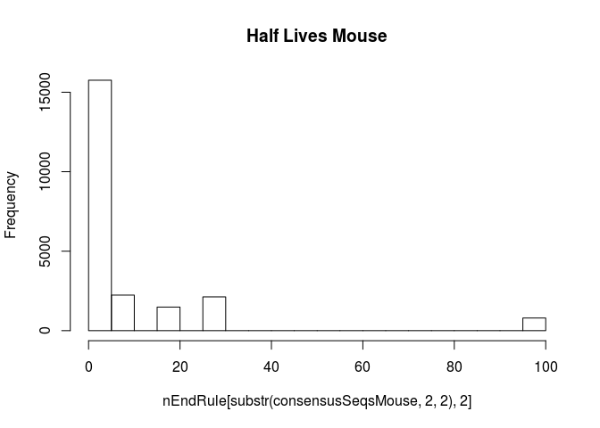

TestingNEndRule
================
MTSchmitz

In this tutorial, I will walk through how to test whether or not developmentally dynamic genes are predicted to have shorter half lives according to the N-end Rule.

### The N-End Rule

There is an old observation in biology that the second residue of a protein is very predictive of that protein's half life. In specific, charged or bulky second amino acids of proteins inhibit the ubiquitous N-terminal start methionine, and this is a signal leading to faster degradation of these proteins. The idea is that perhaps species like mice, shrews and dogs have shorter half lives for developmentally related genes, and therefore would be able to have a more dynamic proteome than primates, whales and elephants. Maybe the fact that developmental proteins are more transient in these species could explain the different rates of embryonic development *in vivo* and which are maintained in differentiations *in vitro*!

You can read more about the N-end Rule here and in the associated references: <https://en.wikipedia.org/wiki/N-end_rule>

``` r
source("http://bioconductor.org/biocLite.R")
library(biomaRt)
library(Biostrings)
#multiple sequence alignment
library(msa)
library(EBSeq)
library(matrixStats)
```

In order to get the protein sequences for the genes we're interested in we first need to know what the gene symbol is called for each of the species we're going to look at. Usually it is hgnc\_symbol, but for mouse, use the mgi\_symbol as it is much better annotated. Change the database you're looking at by changing the dataset variable to include the scientific name of your species of choice.

``` r
findAttribute <- function(string, mart){
  listAttributes(mart)[grepl(string,listAttributes(mart)[,1])|grepl(string,listAttributes(mart)[,2]),]
}
mart <- useMart(biomart = "ENSEMBL_MART_ENSEMBL", dataset = "hsapiens_gene_ensembl", host="www.ensembl.org")
findAttribute("symbol",mart)
```

    ##           name description         page
    ## 63 hgnc_symbol HGNC symbol feature_page

``` r
mart <- useMart(biomart = "ENSEMBL_MART_ENSEMBL", dataset = "mmusculus_gene_ensembl", host="www.ensembl.org")
findAttribute("symbol",mart)
```

    ##           name description         page
    ## 55 hgnc_symbol HGNC symbol feature_page
    ## 63  mgi_symbol  MGI symbol feature_page

``` r
#For Marmoset Dataset
mart <- useMart(biomart = "ENSEMBL_MART_ENSEMBL", dataset = "cjacchus_gene_ensembl", host="www.ensembl.org")
#For Pig Dataset
mart <- useMart(biomart = "ENSEMBL_MART_ENSEMBL", dataset = "sscrofa_gene_ensembl", host="www.ensembl.org")
```

Then we can get the peptide sequences for all genes by leaving out the filter and values field for our biomart requests (This will take a while, as you're retrieving a lot of data). Tell this block to run and go do some lab work.

``` r
mart <- useMart(biomart = "ENSEMBL_MART_ENSEMBL", dataset = "hsapiens_gene_ensembl", host="www.ensembl.org")
#rnSymbol <- getBM(attributes = c("ensembl_gene_id","hgnc_symbol","peptide"),filters = c("hgnc_symbol"),values = c("PAX6","ASCL1") ,mart = mart) 
AllSequencesHuman <- getBM(attributes = c("hgnc_symbol","peptide") ,mart = mart) 


mart <- useMart(biomart = "ENSEMBL_MART_ENSEMBL", dataset = "mmusculus_gene_ensembl", host="www.ensembl.org")
#rnSymbol <- getBM(attributes = c("ensembl_gene_id","mgi_symbol","peptide"),filters = c("mgi_symbol"),values =c("PAX6","ASCL1") ,mart = mart)
AllSequencesMouse <- getBM(attributes = c("mgi_symbol","peptide") ,mart = mart) 
```

``` r
print(AllSequencesHuman[AllSequencesHuman$hgnc_symbol=="PAX6",])
```

    ##        hgnc_symbol
    ## 2524          PAX6
    ## 23716         PAX6
    ## 24067         PAX6
    ## 26723         PAX6
    ## 27446         PAX6
    ## 39412         PAX6
    ## 45417         PAX6
    ## 50228         PAX6
    ## 55161         PAX6
    ## 60795         PAX6
    ## 76310         PAX6
    ## 79709         PAX6
    ## 113337        PAX6
    ## 113407        PAX6
    ## 113726        PAX6
    ## 113776        PAX6
    ## 113816        PAX6
    ## 113831        PAX6
    ## 113875        PAX6
    ## 113981        PAX6
    ## 114100        PAX6
    ## 114308        PAX6
    ## 114395        PAX6
    ## 114428        PAX6
    ## 114510        PAX6
    ## 114630        PAX6
    ## 114645        PAX6
    ## 114646        PAX6
    ## 114803        PAX6
    ## 114967        PAX6
    ## 114985        PAX6
    ## 115402        PAX6
    ## 115432        PAX6
    ## 115559        PAX6
    ## 115627        PAX6
    ## 115688        PAX6
    ## 115732        PAX6
    ##                                                                                                                                                                                                                                                                                                                                                                                                                                                                                           peptide
    ## 2524                                                      MQNSHSGVNQLGGVFVNGRPLPDSTRQKIVELAHSGARPCDISRILQVSNGCVSKILGRYYETGSIRPRAIGGSKPRVATPEVVSKIAQYKRECPSIFAWEIRDRLLSEGVCTNDNIPSVSSINRVLRNLASEKQQMGADGMYDKLRMLNGQTGSWGTRPGWYPGTSVPGQPTQDGCQQQEGGGENTNSISSNGEDSDEAQMRLQLKRKLQRNRTSFTQEQIEALEKEFERTHYPDVFARERLAAKIDLPEARIQVWFSNRRAKWRREEKLRNQRRQASNTPSHIPISSSFSTSVYQPIPQPTTPVSSFTSGSMLGRTDTALTNTYSALPPMPSFTMANNLPMQPPVPSQTSSYSCMLPTSPSVNGRSYDTYTPPHMQTHMNSQPMGTSGTTSTGLISPGVSVPVQVPGSEPDMSQYWPRLQ*
    ## 23716                                       MQNSHSGVNQLGGVFVNGRPLPDSTRQKIVELAHSGARPCDISRILQTHADAKVQVLDNQNVSNGCVSKILGRYYETGSIRPRAIGGSKPRVATPEVVSKIAQYKRECPSIFAWEIRDRLLSEGVCTNDNIPSVSSINRVLRNLASEKQQMGADGMYDKLRMLNGQTGSWGTRPGWYPGTSVPGQPTQDGCQQQEGGGENTNSISSNGEDSDEAQMRLQLKRKLQRNRTSFTQEQIEALEKEFERTHYPDVFARERLAAKIDLPEARIQVWFSNRRAKWRREEKLRNQRRQASNTPSHIPISSSFSTSVYQPIPQPTTPVSSFTSGSMLGRTDTALTNTYSALPPMPSFTMANNLPMQPPVPSQTSSYSCMLPTSPSVNGRSYDTYTPPHMQTHMNSQPMGTSGTTSTGLISPGVSVPVQVPGSEPDMSQYWPRLQ*
    ## 24067                                                                                                                                            MQNSHSGVNQLGGVFVNGRPLPDSTRQKIVELAHSGARPCDISRILQTHADAKVQVLDNQNVSNGCVSSINRVLRNLASEKQQMGADGMYDKLRMLNGQTGSWGTRPGWYPGTSVPGQPTQDGCQQQEGGGENTNSISSNGEDSDEAQMRLQLKRKLQRNRTSFTQEQIEALEKEFERTHYPDVFARERLAAKIDLPEARIQVWFSNRRAKWRREEKLRNQRRQASNTPSHIPISSSFSTSVYQPIPQPTTPVSSFTSGSMLGRTDTALTNTYSALPPMPSFTMANNLPMQPPVPSQTSSYSCMLPTSPSVNGRSYDTYTPPHMQTHMNSQPMGTS
    ## 26723                                                                                                                                                                                                 MGADGMYDKLRMLNGQTGSWGTRPGWYPGTSVPGQPTQDGCQQQEGGGENTNSISSNGEDSDEAQMRLQLKRKLQRNRTSFTQEQIEALEKEFERTHYPDVFARERLAAKIDLPEARIQVWFSNRRAKWRREEKLRNQRRQASNTPSHIPISSSFSTSVYQPIPQPTTPVSSFTSGSMLGRTDTALTNTYSALPPMPSFTMANNLPMQPPVPSQTSSYSCMLPTSPSVNGRSYDTYTPPHMQTHMNSQPMGTSGTTSTGLISPGVSVPVQVPGSEPDMSQYWP
    ## 27446                                                         MQNSHSGVNQLGGVFVNGRPLPDSTRQKIVELAHSGARPCDISRILQVSNGCVSKILGRYYETGSIRPRAIGGSKPRVATPEVVSKIAQYKRECPSIFAWEIRDRLLSEGVCTNDNIPSVSSINRVLRNLASEKQQMGADGMYDKLRMLNGQTGSWGTRPGWYPGTSVPGQPTQDGCQQQEGGGENTNSISSNGEDSDEAQMRLQLKRKLQRNRTSFTQEQIEALEKEFERTHYPDVFARERLAAKIDLPEARIQVWFSNRRAKWRREEKLRNQRRQASNTPSHIPISSSFSTSVYQPIPQPTTPVSSFTSGSMLGRTDTALTNTYSALPPMPSFTMANNLPMQPPVPSQTSSYSCMLPTSPSVNGRSYDTYTPPHMQTHMNSQPMGTSGTTSTGLISPGVSVPVQVPGSEPDMSQYWP
    ## 39412                                                                                                             MQNSHSGVNQLGGVFVNGRPLPDSTRQKIVELAHSGARPCDISRILQTHADAKVQVLDNQNVSNGCVSSINRVLRNLASEKQQMGADGMYDKLRMLNGQTGSWGTRPGWYPGTSVPGQPTQDGCQQQEGGGENTNSISSNGEDSDEAQMRLQLKRKLQRNRTSFTQEQIEALEKEFERTHYPDVFARERLAAKIDLPEARIQVWFSNRRAKWRREEKLRNQRRQASNTPSHIPISSSFSTSVYQPIPQPTTPVSSFTSGSMLGRTDTALTNTYSALPPMPSFTMANNLPMQPPVPSQTSSYSCMLPTSPSVNGRSYDTYTPPHMQTHMNSQPMGTSGTTSTGLISPGVSVPVQVPGSEPDMSQYWPR
    ## 45417                                                                                                                                                            MQNSHSGVNQLGGVFVNGRPLPDSTRQKIVELAHSGARPCDISRILQTHADAKVQVLDNQNVSNGCVSSINRVLRNLASEKQQMGADGMYDKLRMLNGQTGSWGTRPGWYPGTSVPGQPTQDGCQQQEGGGENTNSISSNGEDSDEAQMRLQLKRKLQRNRTSFTQEQIEALEKEFERTHYPDVFARERLAAKIDLPEARIQVWFSNRRAKWRREEKLRNQRRQASNTPSHIPISSSFSTSVYQPIPQPTTPVSSFTSGSMLGRTDTALTNTYSALPPMPSFTMANNLPMQPPVPSQTSSYSCMLPTSPSVNGRSYDTYT
    ## 50228                                                                                                                                                                                                                                           MQNSHSGVNQLGGVFVNGRPLPDSTRQKIVELAHSGARPCDISRILQTHADAKVQVLDNQNVSNGCVSKILGRYYETGSIRPRAIGGSKPRVATPEVVSKIAQYKRECPSIFAWEIRDRLLSEGVCTNDNIPSVSSINRVLRNLASEKQQMGADGMYDKLRMLNGQTGSWGTRPGWYPGTSVPGQPTQDGCQQQEGGGENTNSISSNGEDSDEAQMRLQLKRKLQRNRTSFTQEQIEALEK
    ## 55161                                                                                                                                                                                                                                                                                                                                                                                                                                                                        Sequence unavailable
    ## 60795                                                                                                                                                                                             MGADGMYDKLRMLNGQTGSWGTRPGWYPGTSVPGQPTQDGCQQQEGGGENTNSISSNGEDSDEAQMRLQLKRKLQRNRTSFTQEQIEALEKEFERTHYPDVFARERLAAKIDLPEARIQVWFSNRRAKWRREEKLRNQRRQASNTPSHIPISSSFSTSVYQPIPQPTTPVSSFTSGSMLGRTDTALTNTYSALPPMPSFTMANNLPMQPPVPSQTSSYSCMLPTSPSVNGRSYDTYTPPHMQTHMNSQPMGTSGTTSTGLISPGVSVPVQVPGSEPDMSQYWPRLQ*
    ## 76310                                                                                                                                                                                                                                                                                                                                                                                                                                                                                         MQN
    ## 79709                                                           MQNSHSGVNQLGGVFVNGRPLPDSTRQKIVELAHSGARPCDISRILQVSNGCVSKILGRYYETGSIRPRAIGGSKPRVATPEVVSKIAQYKRECPSIFAWEIRDRLLSEGVCTNDNIPSVSSINRVLRNLASEKQQMGADGMYDKLRMLNGQTGSWGTRPGWYPGTSVPGQPTQDGCQQQEGGGENTNSISSNGEDSDEAQMRLQLKRKLQRNRTSFTQEQIEALEKEFERTHYPDVFARERLAAKIDLPEARIQVWFSNRRAKWRREEKLRNQRRQASNTPSHIPISSSFSTSVYQPIPQPTTPVSSFTSGSMLGRTDTALTNTYSALPPMPSFTMANNLPMQPPVPSQTSSYSCMLPTSPSVNGRSYDTYTPPHMQTHMNSQPMGTSGTTSTGLISPGVSVPVQVPGSEPDMSQY
    ## 113337                                                                                                                                                                                                      MGADGMYDKLRMLNGQTGSWGTRPGWYPGTSVPGQPTQDGCQQQEGGGENTNSISSNGEDSDEAQMRLQLKRKLQRNRTSFTQEQIEALEKEFERTHYPDVFARERLAAKIDLPEARIQVWFSNRRAKWRREEKLRNQRRQASNTPSHIPISSSFSTSVYQPIPQPTTPVSSFTSGSMLGRTDTALTNTYSALPPMPSFTMANNLPMQPPVPSQTSSYSCMLPTSPSVNGRSYDTYTPPHMQTHMNSQPMGTSGTTSTGLISPGVSVPVQVPGSEPD
    ## 113407                                                     MQNSHSGVNQLGGVFVNGRPLPDSTRQKIVELAHSGARPCDISRILQVSNGCVSKILGRYYETGSIRPRAIGGSKPRVATPEVVSKIAQYKRECPSIFAWEIRDRLLSEGVCTNDNIPSVSSINRVLRNLASEKQQMGADGMYDKLRMLNGQTGSWGTRPGWYPGTSVPGQPTQDGCQQQEGGGENTNSISSNGEDSDEAQMRLQLKRKLQRNRTSFTQEQIEALEKEFERTHYPDVFARERLAAKIDLPEARIQVWFSNRRAKWRREEKLRNQRRQASNTPSHIPISSSFSTSVYQPIPQPTTPVSSFTSGSMLGRTDTALTNTYSALPPMPSFTMANNLPMQPPVPSQTSSYSCMLPTSPSVNGRSYDTYTPPHMQTHMNSQPMGTSGTTSTGLISPGVSVPVQVPGSEPDMSQYWPRLQ
    ## 113726                                                                                                                                                                            MQNNGCQQQEGGGENTNSISSNGEDSDEAQMRLQLKRKLQRNRTSFTQEQIEALEKEFERTHYPDVFARERLAAKIDLPEARIQVWFSNRRAKWRREEKLRNQRRQASNTPSHIPISSSFSTSVYQPIPQPTTPVSSFTSGSMLGRTDTALTNTYSALPPMPSFTMANNLPMQDSFPLVCQFQFKFPEVNLICLNTGQDYSKKKKKKKKERKYCVNSVSDYGDTTVELSGKKEKWLLEPLQFYNCVLYCTTGEGMDLKQGPLYTEGTISVGTNLHFGIQTFIHFGVLFVNGHLYVIMKKRTM*
    ## 113776                                                                                                                                                                                                                                            MGADGMYDKLRMLNGQTGSWGTRPGWYPGTSVPGQPTQDGCQQQEGGGENTNSISSNGEDSDEAQMRLQLKRKLQRNRTSFTQEQIEALEKEFERTHYPDVFARERLAAKIDLPEARIQVWFSNRRAKWRREEKLRNQRRQASNTPSHIPISSSFSTSVYQPIPQPTTPVSSFTSGSMLGRTDTALTNTYSALPPMPSFTMANNLPMQPPVPSQTSSYSCMLPTSPSVNGRSYDTYTPP
    ## 113816                                                                                                                                                                                                                                                                              MQNNGCQQQEGGGENTNSISSNGEDSDEAQMRLQLKRKLQRNRTSFTQEQIEALEKEFERTHYPDVFARERLAAKIDLPEARIQVWFSNRRAKWRREEKLRNQRRQASNTPSHIPISSSFSTSVYQPIPQPTTPVSSFTSGSMLGRTDTALTNTYSALPPMPSFTMANNLPMQPPVPSQTSSYSCMLPTSPSVNGRSYDTYTPPH
    ## 113831                                                                                                                                                                                                                                                    MGADGMYDKLRMLNGQTGSWGTRPGWYPGTSVPGQPTQDGCQQQEGGGENTNSISSNGEDSDEAQMRLQLKRKLQRNRTSFTQEQIEALEKEFERTHYPDVFARERLAAKIDLPEARIQVWFSNRRAKWRREEKLRNQRRQASNTPSHIPISSSFSTSVYQPIPQPTTPVSSFTSGSMLGRTDTALTNTYSALPPMPSFTMANNLPMQPPVPSQTSSYSCMLPTSPSVNGR
    ## 113875                                                                                                                                                                                                                       MGADGMYDKLRMLNGQTGSWGTRPGWYPGTSVPGQPTQDGCQQQEGGGENTNSISSNGEDSDEAQMRLQLKRKLQRNRTSFTQEQIEALEKEFERTHYPDVFARERLAAKIDLPEARIQVWFSNRRAKWRREEKLRNQRRQASNTPSHIPISSSFSTSVYQPIPQPTTPVSSFTSGSMLGRTDTALTNTYSALPPMPSFTMANNLPMQPPVPSQTSSYSCMLPTSPSVNGRSYDTYTPPHMQTHMNSQPMGTSGTTSTGL
    ## 113981                                                                                                                                                                                                                                                             MRLQLKRKLQRNRTSFTQEQIEALEKEFERTHYPDVFARERLAAKIDLPEARIQVWFSNRRAKWRREEKLRNQRRQASNTPSHIPISSSFSTSVYQPIPQPTTPVSSFTSGSMLGRTDTALTNTYSALPPMPSFTMANNLPMQPPVPSQTSSYSCMLPTSPSVNGRSYDTYTPPHMQTHMNSQPMGTSGTTSTGLISPGVSVPVQVPGSEPDMSQYWPRLQ*
    ## 114100                                                                                                                                                                                                                                  MGADGMYDKLRMLNGQTGSWGTRPGWYPGTSVPGQPTQDGCQQQEGGGENTNSISSNGEDSDEAQMRLQLKRKLQRNRTSFTQEQIEALEKEFERTHYPDVFARERLAAKIDLPEARIQVWFSNRRAKWRREEKLRNQRRQASNTPSHIPISSSFSTSVYQPIPQPTTPVSSFTSGSMLGRTDTALTNTYSALPPMPSFTMANNLPMQPPVPSQTSSYSCMLPTSPSVNGRSYDTYTPPHMQTHMNSQP
    ## 114308                                                                         MQNSHSGVNQLGGVFVNGRPLPDSTRQKIVELAHSGARPCDISRILQVSNGCVSKILGRYYETGSIRPRAIGGSKPRVATPEVVSKIAQYKRECPSIFAWEIRDRLLSEGVCTNDNIPSVSSINRVLRNLASEKQQMGADGMYDKLRMLNGQTGSWGTRPGWYPGTSVPGQPTQDGCQQQEGGGENTNSISSNGEDSDEAQMRLQLKRKLQRNRTSFTQEQIEALEKEFERTHYPDVFARERLAAKIDLPEARIQVWFSNRRAKWRREEKLRNQRRQASNTPSHIPISSSFSTSVYQPIPQPTTPVSSFTSGSMLGRTDTALTNTYSALPPMPSFTMANNLPMQVSAAGGGLHNPGPREVRSGSGPADLIGCVCTLESFSHYSDWLDQSSRRQSIPSLLSD*
    ## 114395                                                                                        MQNSHSGVNQLGGVFVNGRPLPDSTRQKIVELAHSGARPCDISRILQVSNGCVSKILGRYYETGSIRPRAIGGSKPRVATPEVVSSINRVLRNLASEKQQMGADGMYDKLRMLNGQTGSWGTRPGWYPGTSVPGQPTQDGCQQQEGGGENTNSISSNGEDSDEAQMRLQLKRKLQRNRTSFTQEQIEALEKEFERTHYPDVFARERLAAKIDLPEARIQVWFSNRRAKWRREEKLRNQRRQASNTPSHIPISSSFSTSVYQPIPQPTTPVSSFTSGSMLGRTDTALTNTYSALPPMPSFTMANNLPMQPPVPSQTSSYSCMLPTSPSVNGRSYDTYTPPHMQTHMNSQPMGTSGTTSTGLISPGVSVPVQVPGSEPDMSQYWPRLQ*
    ## 114428                                                                                                                                                                                                                    MGADGMYDKLRMLNGQTGSWGTRPGWYPGTSVPGQPTQDGCQQQEGGGENTNSISSNGEDSDEAQMRLQLKRKLQRNRTSFTQEQIEALEKEFERTHYPDVFARERLAAKIDLPEARIQVWFSNRRAKWRREEKLRNQRRQASNTPSHIPISSSFSTSVYQPIPQPTTPVSSFTSGSMLGRTDTALTNTYSALPPMPSFTMANNLPMQVSAAGGGLHNPGPREVRSGSGPADLIGCVCTLESFSHYSDWLDQSSRRQSIPSLL
    ## 114510                                                                                                           MQNSHSGVNQLGGVFVNGRPLPDSTRQKIVELAHSGARPCDISRILQTHADAKVQVLDNQNVSNGCVSSINRVLRNLASEKQQMGADGMYDKLRMLNGQTGSWGTRPGWYPGTSVPGQPTQDGCQQQEGGGENTNSISSNGEDSDEAQMRLQLKRKLQRNRTSFTQEQIEALEKEFERTHYPDVFARERLAAKIDLPEARIQVWFSNRRAKWRREEKLRNQRRQASNTPSHIPISSSFSTSVYQPIPQPTTPVSSFTSGSMLGRTDTALTNTYSALPPMPSFTMANNLPMQPPVPSQTSSYSCMLPTSPSVNGRSYDTYTPPHMQTHMNSQPMGTSGTTSTGLISPGVSVPVQVPGSEPDMSQYWPRL
    ## 114630                                                                          MQNSHSGVNQLGGVFVNGRPLPDSTRQKIVELAHSGARPCDISRILQTHADAKVQVLDNQNVSNGCVSKILGRYYETGSIRPRAIGGSKPRVATPEVVSSINRVLRNLASEKQQMGADGMYDKLRMLNGQTGSWGTRPGWYPGTSVPGQPTQDGCQQQEGGGENTNSISSNGEDSDEAQMRLQLKRKLQRNRTSFTQEQIEALEKEFERTHYPDVFARERLAAKIDLPEARIQVWFSNRRAKWRREEKLRNQRRQASNTPSHIPISSSFSTSVYQPIPQPTTPVSSFTSGSMLGRTDTALTNTYSALPPMPSFTMANNLPMQPPVPSQTSSYSCMLPTSPSVNGRSYDTYTPPHMQTHMNSQPMGTSGTTSTGLISPGVSVPVQVPGSEPDMSQYWPRLQ*
    ## 114645                                                                                                         MQNSHSGVNQLGGVFVNGRPLPDSTRQKIVELAHSGARPCDISRILQTHADAKVQVLDNQNVSNGCVSKILGRYYETGSIRPRAIGGSKPRVATPEVVSKIAQYKRECPSIFAWEIRDRLLSEGVCTNDNIPSVSSINRVLRNLASEKQQMGADGMYDKLRMLNGQTGSWGTRPGWYPGTSVPGQPTQDGCQQQEGGGENTNSISSNGEDSDEAQMRLQLKRKLQRNRTSFTQEQIEALEKEFERTHYPDVFARERLAAKIDLPEARIQVWFSNRRAKWRREEKLRNQRRQASNTPSHIPISSSFSTSVYQPIPQPTTPVSSFTSGSMLGRTDTALTNTYSALPPMPSFTMANNLPMQPPVPSQTSSYSC
    ## 114646                                                              MQNSHSGVNQLGGVFVNGRPLPDSTRQKIVELAHSGARPCDISRILQVSNGCVSKILGRYYETGSIRPRAIGGSKPRVATPEVVSKIAQYKRECPSIFAWEIRDRLLSEGVCTNDNIPSVSSINRVLRNLASEKQQMGADGMYDKLRMLNGQTGSWGTRPGWYPGTSVPGQPTQDGCQQQEGGGENTNSISSNGEDSDEAQMRLQLKRKLQRNRTSFTQEQIEALEKEFERTHYPDVFARERLAAKIDLPEARIQVWFSNRRAKWRREEKLRNQRRQASNTPSHIPISSSFSTSVYQPIPQPTTPVSSFTSGSMLGRTDTALTNTYSALPPMPSFTMANNLPMQPPVPSQTSSYSCMLPTSPSVNGRSYDTYTPPHMQTHMNSQPMGTSGTTSTGLISPGVSVPVQVPGSEPD
    ## 114803                                                                                                                                                                 MQNSHSGVNQLGGVFVNGRPLPDSTRQKIVELAHSGARPCDISRILQTHADAKVQVLDNQNVSNGCVSSINRVLRNLASEKQQMGADGMYDKLRMLNGQTGSWGTRPGWYPGTSVPGQPTQDGCQQQEGGGENTNSISSNGEDSDEAQMRLQLKRKLQRNRTSFTQEQIEALEKEFERTHYPDVFARERLAAKIDLPEARIQVWFSNRRAKWRREEKLRNQRRQASNTPSHIPISSSFSTSVYQPIPQPTTPVSSFTSGSMLGRTDTALTNTYSALPPMPSFTMANNLPMQPPVPSQTSSYSCMLPTSPSVNGR
    ## 114967                                                                                                                                      MPHKGHSGVNQLGGVFVNGRPLPDSTRQKIVELAHSGARPCDISRILQVSNGCVSKILGRYYETGSIRPRAIGGSKPRVATPEVVSKIAQYKRECPSIFAWEIRDRLLSEGVCTNDNIPSVSSINRVLRNLASEKQQMGADGMYDKLRMLNGQTGSWGTRPGWYPGTSVPGQPTQDGCQQQEGGGENTNSISSNGEDSDEAQMRLQLKRKLQRNRTSFTQEQIEALEKEFERTHYPDVFARERLAAKIDLPEARIQVWFSNRRAKWRREEKLRNQRRQASNTPSHIPISSSFSTSVYQPIPQPTTPVSSFTSGSMLGRTDTALTNTYSALPPMPSFTMANN
    ## 114985 MQNSHSGVNQLGGVFVNGRPLPDSTRQKIVELAHSGARPCDISRILQVSNGCVSKILGRYYETGSIRPRAIGGSKPRVATPEVVSKIAQYKRECPSIFAWEIRDRLLSEGVCTNDNIPSVSSINRVLRNLASEKQQMGADGMYDKLRMLNGQTGSWGTRPGWYPGTSVPGQPTQDGCQQQEGGGENTNSISSNGEDSDEAQMRLQLKRKLQRNRTSFTQEQIEALEKEFERTHYPDVFARERLAAKIDLPEARIQVWFSNRRAKWRREEKLRNQRRQASNTPSHIPISSSFSTSVYQPIPQPTTPVSSFTSGSMLGRTDTALTNTYSALPPMPSFTMANNLPMQDSFPLVCQFQFKFPEVNLICLNTGQDYSKKKKKKKKERKYCVNSVSDYGDTTVELSGKKEKWLLEPLQFYNCVLYCTTGEGMDLKQGPLYTEGTISVGTNLHFGIQTFIHFGVLFVNGHLYVIMKKRTM*
    ## 115402                                                                                                                                                                                                                    MGADGMYDKLRMLNGQTGSWGTRPGWYPGTSVPGQPTQDGCQQQEGGGENTNSISSNGEDSDEAQMRLQLKRKLQRNRTSFTQEQIEALEKEFERTHYPDVFARERLAAKIDLPEARIQVWFSNRRAKWRREEKLRNQRRQASNTPSHIPISSSFSTSVYQPIPQPTTPVSSFTSGSMLGRTDTALTNTYSALPPMPSFTMANNLPMQPPVPSQTSSYSCMLPTSPSVNGRSYDTYTPPHMQTHMNSQPMGTSGTTSTGLISP
    ## 115432                                                                                                                                                                                                                                                                                                                                                                                                                   MQNSHSGVNQLGGVFVNGRPLPDSTRQKIVELAHSGARPCDISRILQTHADAKVQVLDNQNVSNGCVSKILG
    ## 115559                                                                                                                                                                                                                                                                                                                       MQNSHSGVNQLGGVFVNGRPLPDSTRQKIVELAHSGARPCDISRILQTHADAKVQVLDNQNVSNGCVSKILGRYYETGSIRPRAIGGSKPRVATPEVVSKIAQYKRECPSIFAWEIRDRLLSEGVCTNDNIPSVSSLRTSALPALSPMLSPLYLLPPSLSTVS*
    ## 115627                                                                                             MQNSHSGVNQLGGVFVNGRPLPDSTRQKIVELAHSGARPCDISRILQTHADAKVQVLDNQNVSNGCVSKILGRYYETGSIRPRAIGGSKPRVATPEVVSKIAQYKRECPSIFAWEIRDRLLSEGVCTNDNIPSVSSINRVLRNLASEKQQMGADGMYDKLRMLNGQTGSWGTRPGWYPGTSVPGQPTQDGCQQQEGGGENTNSISSNGEDSDEAQMRLQLKRKLQRNRTSFTQEQIEALEKEFERTHYPDVFARERLAAKIDLPEARIQVWFSNRRAKWRREEKLRNQRRQASNTPSHIPISSSFSTSVYQPIPQPTTPVSSFTSGSMLGRTDTALTNTYSALPPMPSFTMANNLPMQDSFPLVCQFQFKFPEVNLICLNTG
    ## 115688                                                           MQNSHSGVNQLGGVFVNGRPLPDSTRQKIVELAHSGARPCDISRILQTHADAKVQVLDNQNVSNGCVSKILGRYYETGSIRPRAIGGSKPRVATPEVVSKIAQYKRECPSIFAWEIRDRLLSEGVCTNDNIPSVSSINRVLRNLASEKQQMGADGMYDKLRMLNGQTGSWGTRPGWYPGTSVPGQPTQDGCQQQEGGGENTNSISSNGEDSDEAQMRLQLKRKLQRNRTSFTQEQIEALEKEFERTHYPDVFARERLAAKIDLPEARIQVWFSNRRAKWRREEKLRNQRRQASNTPSHIPISSSFSTSVYQPIPQPTTPVSSFTSGSMLGRTDTALTNTYSALPPMPSFTMANNLPMQVSAAGGGLHNPGPREVRSGSGPADLIGCVCTLESFSHYSDWLDQSSRRQSIPSLLSD*
    ## 115732                                                                                                                                                                                                  MGADGMYDKLRMLNGQTGSWGTRPGWYPGTSVPGQPTQDGCQQQEGGGENTNSISSNGEDSDEAQMRLQLKRKLQRNRTSFTQEQIEALEKEFERTHYPDVFARERLAAKIDLPEARIQVWFSNRRAKWRREEKLRNQRRQASNTPSHIPISSSFSTSVYQPIPQPTTPVSSFTSGSMLGRTDTALTNTYSALPPMPSFTMANNLPMQPPVPSQTSSYSCMLPTSPSVNGRSYDTYTPPHMQTHMNSQPMGTSGTTSTGLISPGVSVPVQVPGSEPDMSQY

You can see that there are multiple isoforms for a single gene.

I imagine there is a much more efficient way to do what I am about to do, so I'm going to include the following little snippet. Maybe someday you'll figure it out :) The goal here was to create a map for the resolution of alignments where there are gaps.

``` r
#aMap <- rep(1.0/length(AA_STANDARD),length(AA_STANDARD))
aMap <- paste0(AA_ALPHABET,"-")
names(aMap) <- AA_ALPHABET
aMap[(length(aMap)-3):length(aMap)] <- ""
print(aMap)
```

    ##    A    R    N    D    C    Q    E    G    H    I    L    K    M    F    P 
    ## "A-" "R-" "N-" "D-" "C-" "Q-" "E-" "G-" "H-" "I-" "L-" "K-" "M-" "F-" "P-" 
    ##    S    T    W    Y    V    U    O    B    J    Z    X    *    -    +    . 
    ## "S-" "T-" "W-" "Y-" "V-" "U-" "O-" "B-" "J-" "Z-" "X-"   ""   ""   ""   ""

Because there are many isoforms of many proteins, we want to align them to get as complete a peptide sequence as we can. We only actually need the first two residues of the polypeptide sequences, but here we're going to align the full protein sequences. Here you can see the multiple sequence alignment for PAX6:

``` r
msa(AAStringSet(AllSequencesHuman[AllSequencesHuman$hgnc_symbol=="PAX6",2]))
```

    ## use default substitution matrix

    ## CLUSTAL 2.1  
    ## 
    ## Call:
    ##    msa(AAStringSet(AllSequencesHuman[AllSequencesHuman$hgnc_symbol ==     "PAX6", 2]))
    ## 
    ## MsaAAMultipleAlignment with 37 rows and 638 columns
    ##      aln 
    ##  [1] ---------------------------------...---------------------------------
    ##  [2] ---------------------------------...---------------------------------
    ##  [3] ---------------------------------...---------------------------------
    ##  [4] ---------------------------------...---------------------------------
    ##  [5] ---------------------------------...---------------------------------
    ##  [6] ---------------------------------...---------------------------------
    ##  [7] ---------------------------------...---------------------------------
    ##  [8] ---------------------------------...---------------------------------
    ##  [9] ---------------------------------...--------------------------------- 
    ##  ... ...
    ## [30] ---------------------------------...---------------------------------
    ## [31] ---------------------------------...---------------------------------
    ## [32] ---------------------------------...---------------------------------
    ## [33] ---------------------------------...---------------------------------
    ## [34] ---------------------------------...---------------------------------
    ## [35] ---------------------------------...GTNLHFGIQTFIHFGVLFVNGHLYVIMKKRTM-
    ## [36] MQNSHSGVNQLGGVFVNGRPLPDSTRQKIVELA...GTNLHFGIQTFIHFGVLFVNGHLYVIMKKRTM-
    ## [37] ---------------------------------...---------------------------------
    ##  Con ---------------------------------...---------------------------------

The forceConsensus function is going to take the multiple sequence alignments and pick the most common amino acid, even when it is outvoted by gaps in the consensus alignment. This is very inefficient, but it doesn't really matter. You can just run this overnight, and it'll be done long before morning.

``` r
forceConsensus <- function(mat,badind){
  blanks <-  mat[badind,]
  newM <- (sapply(1:ncol(mat), function(i){
    q <- mat[-badind,]
    q[which.max(q[,i]),i] <-  q[which.max(q[,i]),i]+blanks[i]
    q[,i]
  }))
  rownames(newM) <- rownames(mat[-badind,])
  newM
}

consensusSeqsHuman <- lapply(unique(AllSequencesHuman$hgnc),function(g){
  if(length(AllSequencesHuman$peptide[AllSequencesHuman$hgnc_symbol == g])>1){
  align <- consensusString(forceConsensus(consensusMatrix( AAStringSet( msa(AAStringSet(lapply(AllSequencesHuman$peptide[AllSequencesHuman$hgnc_symbol == g],AAString) )))),1))
  }else{
    align <- AllSequencesHuman$peptide[AllSequencesHuman$hgnc_symbol == g]
  }
  align
})
names(consensusSeqsHuman) <- unique(AllSequencesHuman$hgnc)

consensusSeqsMouse <- lapply(unique(AllSequencesMouse$mgi),function(g){
  if(length(AllSequencesMouse$peptide[AllSequencesMouse$mgi_symbol == g])>1){
    align <- consensusString(forceConsensus(consensusMatrix( AAStringSet( msa(AAStringSet(lapply(AllSequencesMouse$peptide[AllSequencesMouse$mgi_symbol == g],AAString) )))),1))
  }else{
    align <- AllSequencesMouse$peptide[AllSequencesMouse$mgi_symbol == g]
  }
  align
})
names(consensusSeqsMouse) <- toupper(unique(AllSequencesMouse$mgi))
```

Because that took forever, we can save our R environment like this, so we can pull them up whenever we need.

``` r
save.image(file="~/Desktop/PeptideSeqs.RData")
```

Here we will load the expected half lifes from the table gleaned from the wikipedia page.

``` r
#From biostrings package
b <-  AMINO_ACID_CODE
names(b) <- b
names(b) <- names(AMINO_ACID_CODE)
nEndRule <-  read.table("~/code/GhostOfMT/Data/nEndRule.txt",stringsAsFactors = F)
#Need to translate between three letter AA codes and 1 letter codes for the peptide sequence
for(aa in b[!b%in%nEndRule[,1]])nEndRule <-  rbind(nEndRule ,c(aa,NA))
nEndRule[,2] <- as.numeric(gsub("h","",nEndRule[,2]))
rownames(nEndRule) <- sapply(nEndRule[,1], function(aa) names(b)[which(aa==b)] )
print(nEndRule)
```

    ##    V1    V2
    ## V Val 100.0
    ## M Met  30.0
    ## G Gly  30.0
    ## P Pro  20.0
    ## I Ile  20.0
    ## T Thr   7.2
    ## L Leu   5.5
    ## A Ala   4.4
    ## H His   3.5
    ## W Trp   2.8
    ## Y Tyr   2.8
    ## S Ser   1.9
    ## N Asn   1.4
    ## K Lys   1.3
    ## C Cys   1.2
    ## D Asp   1.1
    ## F Phe   1.1
    ## E Glu   1.0
    ## R Arg   1.0
    ## Q Gln   0.8
    ## U Sec    NA
    ## O Pyl    NA
    ## B Asx    NA
    ## J Xle    NA
    ## Z Glx    NA
    ## X Xaa    NA

Now let's get a substring representing the second amino acid of the peptide sequences and see how long we expect the half lives to be for mouse and human!

``` r
hist(nEndRule[substr(consensusSeqsHuman,2,2),2],main="Half Lives Human")
```


``` r
hist(nEndRule[substr(consensusSeqsMouse,2,2),2], main= "Half Lives Mouse")
```



``` r
print("Human Mean in hrs:")
```

    ## [1] "Human Mean in hrs:"

``` r
mean(nEndRule[substr(consensusSeqsHuman,2,2),2],na.rm=T)
```

    ## [1] 10.5917

``` r
print("Mouse Mean in hrs:")
```

    ## [1] "Mouse Mean in hrs:"

``` r
mean(nEndRule[substr(consensusSeqsMouse,2,2),2],na.rm=T)
```

    ## [1] 9.982601

Pretty much exactly the same... This is for all the genes in the genome though. What if it is just specific to developmentally dynamic genes?!

``` r
source("~/code/GhostOfMT//Tutorials/LoadData.R")

print("Number of genes with a log fold change >4 over the course of the time series")
```

    ## [1] "Number of genes with a log fold change >4 over the course of the time series"

``` r
print("Human")
```

    ## [1] "Human"

``` r
sum(rowMaxs(normCountsH)-rowMins(normCountsH) >4)
```

    ## [1] 4754

``` r
print("Mouse")
```

    ## [1] "Mouse"

``` r
sum(rowMaxs(normCountsM)-rowMins(normCountsM) >4)
```

    ## [1] 4129

``` r
devM <-  rownames(normCountsM)[rowMaxs(normCountsM)-rowMins(normCountsM) >4]
devH <- rownames(normCountsH)[rowMaxs(normCountsH)-rowMins(normCountsH) >4]

hist(nEndRule[substr(consensusSeqsHuman[devH],2,2),2],main = "Human Developmental Genes Half Life Hrs")
```


``` r
hist(nEndRule[substr(consensusSeqsMouse[devM],2,2),2], main = "Mouse Developmental Genes Half Life Hrs")
```


``` r
print("Human median half life")
```

    ## [1] "Human median half life"

``` r
median(nEndRule[substr(consensusSeqsHuman[devH],2,2),2],na.rm=T)
```

    ## [1] 4.4

``` r
print("Mouse median half life")
```

    ## [1] "Mouse median half life"

``` r
median(nEndRule[substr(consensusSeqsHuman[devM],2,2),2],na.rm=T)
```

    ## [1] 4.4

The same. Mouse embryonic development is 3x as fast as human, so no point in doing statistics... Looks like we have a negative result. It was a fun idea though, right?
