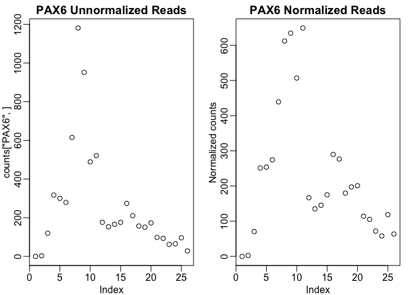
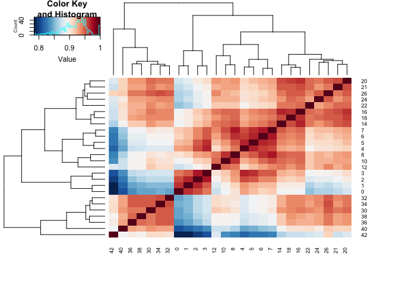
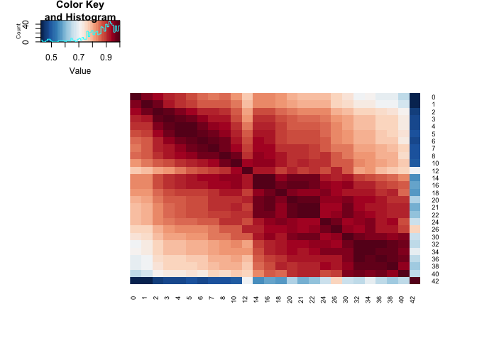
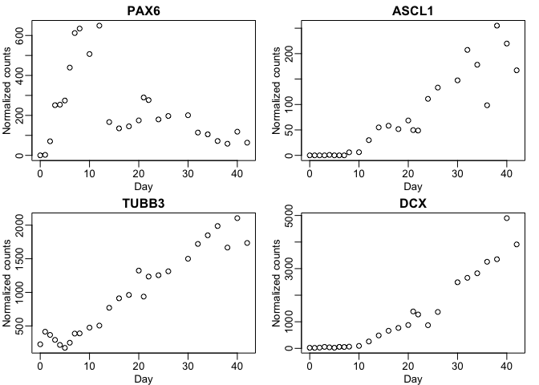
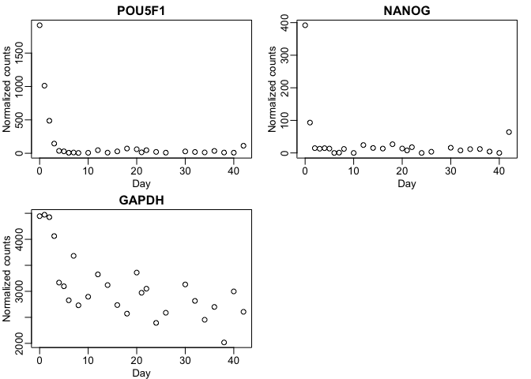

BasicRNAseq
================
MTSchmitz

Basic RNAseq Analysis
=====================

### Loading Files and Exploratory Data Analysis

##### Quick basic computer tips and vocab beforehand:

**directory** means folder in computer lingo

**command line**: the terminal app on mac, a basic guide can be found here: <https://www.tjhsst.edu/~dhyatt/superap/unixcmd.html>

**library**: An R package, a bunch of code and functions wrapped up which can be loaded together with library()

**array** What you get when you string things together using c()

**list**: A data structure like an array, get a single element using double brackets \[\[\]\] instead of single brackets \[\]

If the computer can't find a function, you probably haven't loaded the library you need! Paste error messages into google. You can solve 99.999% of your problems by copying and pasting to and from google or stackOverflow

Loading a File
--------------

Most of data you will be dealing with will probably be RSEM outputs. These outputs are usually structured as a directory with a name like "Sub\_0146\_Developmental\_Clock\_Human\_hg19\_\_890bf46a388bf6b4". Inside will be a mess of files, the most likely ones you will be working with are genes.no\_mt.**ec**.tab for counts data (NOT NORMALIZED) or TPMs genes.no\_mt.**tpm**.renorm.tab.

**QUICK NOTE:** If you have opened your files in Excel, always check the genes "MARCH1" and "SEPT1" to make sure that these gene names haven't been transformed into dates. If they have and you share/publish this data, people will instantly know you are a noob and discount any analysis you do!s

You can type "pwd ~" (pwd stands for print working directory) on the command line and it will tell you what your home directory is. Then you can do paths like ~/GhostOfMT/Data/FILENAME.txt

We will start by installing the packages we need:

Once we have those, we can load up the RNAseq file, which you can download from the Data folder in this Github Repo

read.csv2 is a versatile function that you can use to read data files that are delineated with a bunch of stuff. It's not magic though, and if your files are irregular or tampered with, it won't save you.

The parameters of this function are very important. header is a T/F parameter stating whether or not the first line of the file is the column names. row.names is a numeric parameter asking which column should be rownames (enter 0 if none, or you have duplicated gene names). The sep value is what the separator is for this file type. "" is code for tab. You can do " " for space, or "," for comma-separated variable (csv) files. RSEM outputs tab-separated variable files (.tab or .tsv) and this line should work on RSEM output files out of the box.

type ?read.csv2 into the prompt in RStudio and it will give you more info!

You should change the path to the file (pathToFile) within the quotes to the path on your computer.

You can get the number of reads in each sample by getting the sum of the count numbers for each column (Genes are rows, Samples are columns)

    ##  H1Rosa7_d0  H1Rosa7_d1  H1Rosa7_d2  H1Rosa7_d3  H1Rosa7_d4  H1Rosa7_d5 
    ##   2535843.2   2395744.7   3123291.4   2277212.7   2140561.8   1821945.8 
    ##  H1Rosa7_d6  H1Rosa7_d7  H1Rosa7_d8 H1Rosa7_d10 H1Rosa7_d12 H1Rosa7_d14 
    ##   2485047.4   3322224.2   2669096.6   1711863.8   1426164.3   1807225.6 
    ## H1Rosa7_d16 H1Rosa7_d18 H1Rosa7_d20 H1Rosa7_d21 H1Rosa7_d22 H1Rosa7_d24 
    ##   1923557.4   1928532.0   1708037.4   1644661.4   1316266.1   1451445.5 
    ## H1Rosa7_d26 H1Rosa7_d30 H1Rosa7_d32 H1Rosa7_d34 H1Rosa7_d36 H1Rosa7_d38 
    ##   1311997.9   1520466.2   1509128.7   1550805.8   1522965.3   1956161.9 
    ## H1Rosa7_d40 H1Rosa7_d42 
    ##   1529980.2    908853.4

If everything looks good, now we have to normalize the counts data, because the data is Expected Counts. TPMs are already normalized, so you should skip this step if you're working with TPMs. **YOU HAVE TO NORMALIZE COUNTS OR LIFE IS MEANINGLESS** (sample comparisons will be confounded by read depth)

It also might be helpful to parse the timepoints from the sample names. (Quite helpful.) The split parameter is a short bit of text that divides the different parts of longer strings of characters (sample names). This is why smart, standard naming of samples in the database is paramount!

    ## [[1]]
    ## [1] "H1Rosa7" "0"      
    ## 
    ## [[2]]
    ## [1] "H1Rosa7" "1"      
    ## 
    ## [[3]]
    ## [1] "H1Rosa7" "2"      
    ## 
    ## [[4]]
    ## [1] "H1Rosa7" "3"      
    ## 
    ## [[5]]
    ## [1] "H1Rosa7" "4"      
    ## 
    ## [[6]]
    ## [1] "H1Rosa7" "5"

This gives us something tricky to use. First we use sapply to change the list to a matrix, where the first row is the cell type and the second row is the time point:

    ## [1]  2 26

    ##      [,1]      [,2]      [,3]      [,4]      [,5]      [,6]      [,7]     
    ## [1,] "H1Rosa7" "H1Rosa7" "H1Rosa7" "H1Rosa7" "H1Rosa7" "H1Rosa7" "H1Rosa7"
    ## [2,] "0"       "1"       "2"       "3"       "4"       "5"       "6"      
    ##      [,8]      [,9]      [,10]     [,11]     [,12]     [,13]     [,14]    
    ## [1,] "H1Rosa7" "H1Rosa7" "H1Rosa7" "H1Rosa7" "H1Rosa7" "H1Rosa7" "H1Rosa7"
    ## [2,] "7"       "8"       "10"      "12"      "14"      "16"      "18"     
    ##      [,15]     [,16]     [,17]     [,18]     [,19]     [,20]     [,21]    
    ## [1,] "H1Rosa7" "H1Rosa7" "H1Rosa7" "H1Rosa7" "H1Rosa7" "H1Rosa7" "H1Rosa7"
    ## [2,] "20"      "21"      "22"      "24"      "26"      "30"      "32"     
    ##      [,22]     [,23]     [,24]     [,25]     [,26]    
    ## [1,] "H1Rosa7" "H1Rosa7" "H1Rosa7" "H1Rosa7" "H1Rosa7"
    ## [2,] "34"      "36"      "38"      "40"      "42"

That was a bit complicated. In plain english, this is what happened. Assign the following to the variable "splitMatrix": loop through the objects stored in splitList, for each one, take elements number 1 through the minimum number of elements in the whole splitlist. It should work for any strsplit output, as long as your sample namings are consistent!

Lastly, we'll take the second row of this matrix, which should be the day at which each sample was taken, and convert it to a numeric (it is currently characters ("9") instead of numbers (9) )

We have the timepoints (in days) captured as "tps"" and also have renamed the column names of normCounts to the timepoints, so we're ready for some plotting!

Now for some exploratory data analysis!!!
-----------------------------------------

To make a heatmap of the spearman (rank) correlations of the samples with each other: **note:** Spearman rank correlation doesn't need to be normalized counts. Be careful though, pearson correlations do need to be normalized. Also, TPM values are scaled by the length of each specific gene, which changes the order. Therefore **you CAN'T compare TPMs to Counts**

Or the pearson correlations (with samples not clustered in the heatmap, which you do with Rowv and Colv = F parameters)

### Plot a list of genes

Now we take an array of genes

### Save Scatterplots to a PDF

We can also save this output as a multipage PDF by wrapping the code that creates a plot for each gene inside of the pdf(), which opens a pdf writer as the place your plots will be outputted to, and dev.off() which finalizes and saves the pdf.
