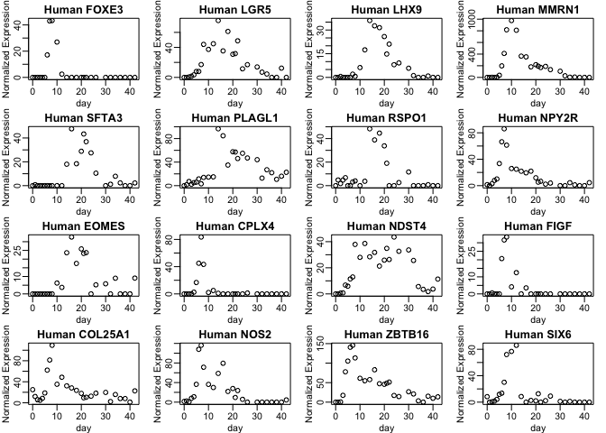
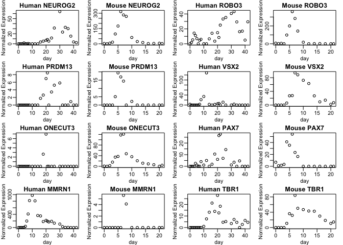
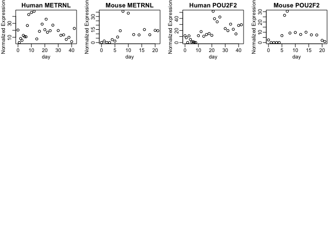

PeakFinder
==========

Finds transiently expressed Genes with a single peak in middle of expression, minimizing expression not during the peak. This is not a statistical algorithm, it is meant for exploratory data analysis and finding suitable targets for reporters.

See BasicRNAseq.md for more information on loading files

``` r
#load the packages you'll need:
#for normalizing
library(EBSeq)
#for changing view layout
library(rafalib)
#For rowMeans and colMaxs functions
library(matrixStats)
```

Load a differentiation for both human and mouse

``` r
pathToFileH <- "~/code/GhostOfMT/Data/GSE90053_H1_EC.txt"
#NOTE THE PARAMETERS
countsH <- read.csv2(file=pathToFileH,header = T,row.names = 1,sep = "\t")
#countsH <- countsH[,-ncol(countsH)] #uncomment this line if the last column is gene name description text
#It removes the last column of the data from the data set
countsH <- as.matrix(countsH)
storage.mode(countsH) <- "numeric"
normCountsH <- GetNormalizedMat(countsH, MedianNorm(countsH))
splitListH <- strsplit(x = colnames(normCountsH),split = "_d")
splitMatrixH <- sapply(splitListH, "[", 1:max(sapply(splitListH,length)) )
tpsH <- as.numeric(splitMatrixH[2,])
colnames(normCountsH) <- tpsH

pathToFileM <- "~/code/GhostOfMT/Data/GSE90053_mEpi_EC.txt"
#NOTE THE PARAMETERS
countsM <- read.csv2(file=pathToFileM,header = T,row.names = 1,sep = "\t")
#countsM <- countsM[,-ncol(countsM)] #uncomment this line if the last column is gene name description text
#It removes the last column of the data from the data set
countsM <- as.matrix(countsM)
storage.mode(countsM) <- "numeric"
#Make the genenames for mouse all uppercase.
#It will be very annoying to compare mouse and human if they are left with different conventional capitalizations
rownames(countsM) <- toupper(rownames(countsM))
normCountsM <- GetNormalizedMat(countsM, MedianNorm(countsM))
splitListM <- strsplit(x = colnames(normCountsM),split = "_d")
splitMatrixM <- sapply(splitListM, "[", 1:max(sapply(splitListM,length)) )
tpsM <- as.numeric(splitMatrixM[2,])
colnames(normCountsM) <- tpsM
```

Now we have loaded expression for mouse and human. The algorithm doesn't have a package for loading it so we will load three functions that constitute the algorithm by hand.

Loading Algorithm
-----------------

``` r
#Log Transform the data
round.log <- function(s,base=2){
  round(log(s+1, base),digits = 1)
}

#Function takes a vector of booleans (value > threshold) and an index (representing the max). 
#Walks out from this index and returns contiguous indices > threshold
stepOut <- function(v,i,skip.num=1){
  inds <- 1:length(v)
  iu <- i+1
  id <- i-1
  u <- 0
  d <- 0
  ret.inds <- c()
  if(v[i]){
    ret.inds <- c(ret.inds,i)
    while(u<=skip.num){
      if(iu %in% inds){
        if(v[iu]){
          ret.inds <- c(ret.inds,iu)
          iu <- iu+1
        }else{
          u <- u+1
        }
      }else{
        u <- u+1
      }
    }
    while(d<=skip.num){
      if(id %in% inds){
        if(v[id]){
          ret.inds <- c(ret.inds,id)
          id <- id-1
        }else{
          d <- d+1
        }
      }else{
        d <- d+1
      }
    }
  }
  ret.inds
}

#Finds the expression area around the max expression for each gene
maxArea <- function(ds,tpds,thresh=1,skip.num=1){
  w.m <- apply(ds,1,which.max)
  #vals <- rowMaxs(ds)
  vals <-  sapply(1:nrow(ds),function(i){
    #Get the sum of values contiguous with max
    sum(ds[i,stepOut(ds[i,]>thresh,which.max(ds[i,]),skip.num = skip.num)])
  })
  vals
}

peakScore <- function(ds,tpds,thresh=seq(.5,5,by = .5)){
  ds <- round.log(ds[,order(tpds)])
  weightedScores <- lapply(1:length(thresh),function(t){
    bscore <- rep(0,nrow(ds))
    escore <- rep(0,nrow(ds))
    utpds <- sort(unique(tpds))
    #count the number of zeroes (less than threshold) in the beginning (bscore)
    for(i in 1:(length(utpds)-1)){
      if(sum(tpds== utpds[i])>1){
        binds <-  rowMeans(ds[,tpds == utpds[i]]) < thresh[t]
      }else{
        binds <-  ds[,tpds == utpds[i]] < thresh[t]
      }
      bscore <-  bscore + as.integer(bscore >= i-1 & binds)
    }
    #count the number of zeroes in the end (escore)
    for(i in length(utpds):2){
      if(sum(tpds==utpds[i])>1){
        einds  <-  rowMeans(ds[,tpds == utpds[i]]) < thresh[t]
      }else{
        einds <-  ds[,tpds == utpds[i]] < thresh[t]
      }
      escore <-  escore +  as.integer(escore >= abs(i-length(utpds)) & einds)
    }
    res <- cbind(bescore=(bscore*escore),peakArea=(maxArea(ds,tpds,thresh[t])))
    rownames(res) <- rownames(ds)
    res
  })
  condenseScores <- Reduce(cbind,lapply(weightedScores,function(x){x[,1]*x[,2]}))
  normMat <- GetNormalizedMat(condenseScores , colMaxs(condenseScores))
  #normMat <- GetNormalizedMat(condenseScores , seq(minweight,1,length.out = ncol(condenseScores)))
  mxs <- rowMaxs(normMat)
  names(mxs) <- rownames(ds)
  mxs
}
```

Using PeakFinder
----------------

Call the peakScore function with the counts and the time points to get the scores, then sort them

``` r
HumanScores <-  sort(peakScore(normCountsH,tpsH),decreasing = T)
MouseScores <-  sort(peakScore(normCountsM,tpsM),decreasing = T)

print(HumanScores[1:30])
```

    ##     FOXE3      LGR5      LHX9     MMRN1     SFTA3    PLAGL1     RSPO1 
    ## 1.0000000 1.0000000 1.0000000 1.0000000 0.9762058 0.9665272 0.9125402 
    ##     NPY2R     EOMES     CPLX4     NDST4      FIGF   COL25A1      NOS2 
    ## 0.8971061 0.8849518 0.8409786 0.8360129 0.8229358 0.8224268 0.8218650 
    ##    ZBTB16      SIX6      TBR1     CNTN6     SPHK1      B9D2    LEFTY2 
    ## 0.8093724 0.8069132 0.8021865 0.7929260 0.7929260 0.7635074 0.7591093 
    ##       RAX     MXRA8    CTHRC1      LHX8       SP8      JPH2    TMEM88 
    ## 0.7509646 0.7468167 0.7441004 0.7408089 0.7373222 0.7176849 0.7166559 
    ##     FSIP2      ENO3 
    ## 0.7082008 0.6973965

This will give you the scores of the mouse and human peak genes. Scores closer to 1 mean genes have higher and cleaner peaks. We can plot the top genes to see if the algorithm has worked.

names(HumanScores)\[1:16\] gets the names of the top 16 human genes, because we have already sorted them above. This can be done because the HumanScores has named values (each value in the array has a gene name attached to it).

``` r
mypar(4,4)
for(g in names(HumanScores)[1:16]){
  plot(tpsH,normCountsH[g,],main = paste("Human",g),xlab = "day",ylab = "Normalized Expression")
}
```



And the top 16 Mouse genes

``` r
mypar(4,4)
for(g in names(MouseScores)[1:16]){
  plot(tpsM,normCountsM[g,],main = paste("Mouse",g),xlab = "day",ylab = "Normalized Expression")
}
```


Lastly, we can find genes that are in the top 200 scoring genes for both species:

``` r
mypar(4,4)
L <- 200
for(g in intersect(names(MouseScores)[1:L],  names(HumanScores)[1:L])){
  plot(tpsH,normCountsH[g,],main = paste("Human",g),xlab = "day",ylab = "Normalized Expression")
  plot(tpsM,normCountsM[g,],main = paste("Mouse",g),xlab = "day",ylab = "Normalized Expression")
}
```


