MTSchmitz

Plotting Favorite Genes Along a Multi-Condition Time Series
===========================================================

### Loading Gene Lists

Lists of your favorite genes might come from any number of sources. You can see how to make one based upon GO term annotation in the QueryingGO tutorial. You can also enter them in a column in excel and save the file as a tab delimited text file.

Reminder: In Rstudio typing a ? in front of a function or package you don't understand pulls up the help documents.

Here we load THEneuralList\_2017.txt, which can be found in the Data directory of this repository. **Don't forget to replace the path with the correct location of the file on your own computer!** The function unique() removes any duplicates in the list, and toupper is necessary because if you're comparing mouse and human gene names, you won't be able to match them if they aren't the same case. Just to note, the neuralList is not a list in the R data structure sense (it's a vector of character strings).

``` r
pathToList <- "~/code/GhostOfMT/Data/GeneLists/THEneuralList_2017.txt"
#NOTE THE PARAMETERS
rawList <- read.csv2(file=pathToList,header = F,sep = "\t",stringsAsFactors = F)
neuralList <- unique(toupper(rawList[,1]))
print(neuralList)
```

    ##   [1] "PAX6"    "SOX1"    "OTX1"    "OTX2"    "LHX2"    "DLK1"    "EMX2"   
    ##   [8] "IRX3"    "ASCL1"   "TBR1"    "TBR2"    "FOXG1"   "CUX1"    "POU3F2" 
    ##  [15] "BCL11B"  "SOX2"    "RELN"    "EOMES"   "SATB2"   "TUBB3"   "MAP1B"  
    ##  [22] "MAP2"    "DCX"     "VIM"     "NES"     "STMN2"   "GLI1"    "GLI2"   
    ##  [29] "GLI3"    "MEIS1"   "MEIS2"   "GNG2"    "INSM1"   "MYT1L"   "NCAM1"  
    ##  [36] "ELAVL4"  "NEFL"    "NHLH2"   "SPOCK2"  "RCAN2"   "GAP43"   "NEUROD1"
    ##  [43] "NEUROD2" "NEUROD4" "NEUROD6" "NEUROG1" "NEUROG2" "OLIG2"   "FABP7"  
    ##  [50] "GFAP"    "HES1"    "HES6"    "SLC1A3"  "GABBR1"  "GABARAP" "GAD1"   
    ##  [57] "SYT1"    "SYT4"    "SYT11"   "SNAP25"  "SLC17A6" "SLC18A1" "SLC18A2"
    ##  [64] "GRIA1"   "GRIA2"   "NOG"     "SHH"     "DBH"     "ISL1 "   "TH"     
    ##  [71] "FOXA1"   "FOXA2"   "NKX2-1"  "NKX2-2"  "NKX6-1"  "NK6-2"   "MNX1"   
    ##  [78] "CHAT"    "DDC"     "PAX7"    "LMX1A"   "LMX1B"   "PHOX2A"  "PHOX2B" 
    ##  [85] "CORIN"   "POU5F1"  "NANOG"   "HOXA1"   "HOXA10"  "HOXA11"  "HOXA13" 
    ##  [92] "HOXA2"   "HOXA3"   "HOXA4"   "HOXA5"   "HOXA6"   "HOXA7"   "HOXA9"  
    ##  [99] "HOXB1"   "HOXB13"  "HOXB2"   "HOXB3"   "HOXB4"   "HOXB5"   "HOXB6"  
    ## [106] "HOXB7"   "HOXB8"   "HOXB9"   "HOXC10"  "HOXC11"  "HOXC12"  "HOXC13" 
    ## [113] "HOXC4"   "HOXC5"   "HOXC6"   "HOXC8"   "HOXC9"   "HOXD1"   "HOXD10" 
    ## [120] "HOXD11"  "HOXD12"  "HOXD13"  "HOXD3"   "HOXD4"   "HOXD8"   "HOXD9"

### Loading RNAseq Data files

You should see the beginning of the tutorial for BasicRNAseq if you want more info on loading unnormalized counts files, or to install packages you're missing.

``` r
#load the packages you'll need:
#for normalizing
library(EBSeq)
#for changing view layout
library(rafalib)
#for the color palette
library(RColorBrewer)
#for fancy plots
library(gplots)
library(ggplot2)
```

Once we have those packages loaded, we can load up the RNAseq file, which you can download from the Data folder in this Github Repo. This file is TPMs, which are normalized by both the number of reads, and the length of each transcript (in number of base pairs). Because TPMs are normalized by length of transcript by RSEM, you can't compare them to "normalized counts". Be aware

``` r
pathToFile <- "~/code/GhostOfMT/Data/GSE90053_H1_TPM.txt"
#NOTE THE PARAMETERS
hTPMs <- read.csv2(file=pathToFile,header = T,row.names = 1,sep = "\t")
#hTPMs <- hTPMs[,-ncol(hTPMs)] #uncomment this line if the last column is gene name description text (or modify it if it is a different column)
#It removes the last column of the data from the data set
hTPMs <- as.matrix(hTPMs)
storage.mode(hTPMs) <- "numeric"
rownames(hTPMs) <- toupper(rownames(hTPMs))

pathToFileM <- "~/code/GhostOfMT/Data/GSE90053_mEpi_TPM.txt"
#NOTE THE PARAMETERS
mTPMs <- read.csv2(file=pathToFileM,header = T,row.names = 1,sep = "\t")
#mTPMS <- mTPMs[,-ncol(mTPMs)] #uncomment this line if the last column is gene name description text (or modify it if it is a different column)
#It removes the last column of the data from the data set
mTPMs <- as.matrix(mTPMs)
storage.mode(mTPMs) <- "numeric"
rownames(mTPMs) <- toupper(rownames(mTPMs))
```

You can check that you're dealing with TPMs, because each column should sum to 1,000,000 (slightly off due to mystery rounding error)

``` r
colSums(hTPMs)
```

    ##  H1Rosa7_d0  H1Rosa7_d1  H1Rosa7_d2  H1Rosa7_d3  H1Rosa7_d4  H1Rosa7_d5 
    ##   1000000.0   1000000.6   1000000.0   1000000.8   1000000.4   1000000.1 
    ##  H1Rosa7_d6  H1Rosa7_d7  H1Rosa7_d8 H1Rosa7_d10 H1Rosa7_d12 H1Rosa7_d14 
    ##   1000000.3   1000000.2   1000000.1    999999.6    999999.7   1000000.0 
    ## H1Rosa7_d16 H1Rosa7_d18 H1Rosa7_d20 H1Rosa7_d21 H1Rosa7_d22 H1Rosa7_d24 
    ##    999999.4   1000000.3   1000000.7   1000000.2    999999.2    999999.2 
    ## H1Rosa7_d26 H1Rosa7_d30 H1Rosa7_d32 H1Rosa7_d34 H1Rosa7_d36 H1Rosa7_d38 
    ##   1000000.6    999999.6   1000000.0    999999.9    999999.5   1000000.4 
    ## H1Rosa7_d40 H1Rosa7_d42 
    ##   1000000.3    999999.7

See the BasicRNAseq tutorial for more explanation on this parsing colnames to get timepoints

``` r
splitList <- strsplit(x = colnames(hTPMs),split = "_d")
splitMatrix <- sapply(splitList, "[", 1:max(sapply(splitList,length)) )
tpsH <- as.numeric(splitMatrix[2,])
conditionsH <- splitMatrix[1,]
splitList <- strsplit(x = colnames(mTPMs),split = "_d")
splitMatrix <- sapply(splitList, "[", 1:max(sapply(splitList,length)) )
tpsM <- as.numeric(splitMatrix[2,])
conditionsM <- gsub("_Sorted","",splitMatrix[1,])
```

If you want to be a smart scripter, instead of copying and pasting the same code twice and slightly modifying it , you can wrap it into a function

``` r
getConditionsFromColnames <- function(data,split="_",ind=1 ){
  splitList <- strsplit(x = colnames(data),split = split)
  splitMatrix <- sapply(splitList, "[", 1:max(sapply(splitList,length)) )
  return(splitMatrix[ind,])
}

tpsH <- as.numeric(getConditionsFromColnames(hTPMs,"_d",2))
conditionsH <- getConditionsFromColnames(hTPMs,"_d",1)
tpsM <- as.numeric(getConditionsFromColnames(mTPMs,"_d",2))
conditionsM <- gsub("_Sorted","",getConditionsFromColnames(mTPMs,"_d",1))
```

Speaking of functions, here is a helpful function that will allow you to stick two matrices together, filling in zeros for genes that are not shared between the two datasets

``` r
rn.merge <- function(x,y,fill=0){
  rn <- intersect(rownames(x),rownames(y))
  zerosx <- setdiff(rownames(x),rownames(y))
  zerosy <- setdiff(rownames(y),rownames(x))
  out <- cbind(x[rn,],y[rn,])
  if(length(zerosx)!=1  &length(zerosy)!=1){
    zx <- matrix(fill, nrow=length(zerosx), ncol =ncol(y), dimnames = list(zerosx,NULL))
    zy <- matrix(fill, nrow=length(zerosy), ncol =ncol(x), dimnames = list(zerosy,NULL))
    zx <- cbind(x[zerosx,],zx)
    zy <- cbind(zy,y[zerosy,])
  }else if(length(zerosx)==1){
    zx <- rep(fill, ncol(y))
    zy <- matrix(fill, nrow=length(zerosy), ncol =ncol(x), dimnames = list(zerosy,NULL))
    zx <- c(x[zerosx,],zx)
    zy <- cbind(zy,y[zerosy,])
  }else if(length(zerosy)==1){
    zx <- matrix(fill, nrow=length(zerosx), ncol =ncol(y), dimnames = list(zerosx,NULL))
    zy <- rep(fill, ncol(x))
    print(zx)
    print(zy)
    zx <- cbind(x[zerosx,],zx)
    zy <- c(zy,y[zerosy,])
  }
  out <- rbind(out,rbind(zx,zy))
  return(out)

}

#This function will allow you to plot just a legend by itself
g_legend<-function(a.gplot){ 
  tmp <- ggplot_gtable(ggplot_build(a.gplot)) 
  leg <- which(sapply(tmp$grobs, function(x) x$name) == "guide-box") 
  legend <- tmp$grobs[[leg]] 
  return(legend)
  } 
```

We have the timepoints (in days) captured as "tps"" and also have renamed the column names of hTPMS to the timepoints, as well as having the other condition group (in this case it is species) in the conditions vectors! We can use the rn.merge function to put all the data together, while concatenating all the conditions and time points.

### Plotting together

``` r
#melt function
library(reshape2)
#for time series analysis
library(zoo)
#for plotting
library(ggplot2)
library(grid)
library(gridExtra)
#You can string together as many datasets as you as you want!
conditionsMerged <- c(conditionsH,conditionsM)
tpMerged <- c(tpsH,tpsM)
dataMerged <- rn.merge(hTPMs,mTPMs)
ggg <- NULL
gene_list <- neuralList[neuralList%in%rownames(dataMerged)]

if(length(tpMerged)!=length(conditionsMerged))stop("You need to have the same number of conditions and time points")

plotlist <- lapply( gene_list,function(gn){
  #Calculate mean values
  meanGenes <- lapply(unique(conditionsMerged),function(x){
    data.frame(condit=rep(x, sum(conditionsMerged==x)),tp=tpMerged[conditionsMerged==x],value=dataMerged[gn,conditionsMerged==x])
  })
  ds <- Reduce(rbind,meanGenes)
  gg <-  ggplot(ds, aes(x=tp, y=value, group=condit,colour=condit)) + 
    geom_point(size=1) +
    theme_bw(base_size = 6) +
    theme(legend.position="none",
          panel.grid.major = element_blank(),
          panel.grid.minor = element_blank(),
          panel.background = element_blank())+
    labs(x = "Time", y = "Expression", 
         title = gn,family="arial",size=6)
  gg
  ggg <<- gg
  })
#plot just the legend
#Extract Legend 
legend <- g_legend(ggg+theme(legend.position="left",
          panel.grid.major = element_blank(),
          panel.grid.minor = element_blank(),
          panel.background = element_blank())) 
grid.draw(legend) 
```


``` r
#output this whole list of plots as a PDF on your desktop
marrangeGrob(grobs=plotlist , nrow=4, ncol=4,top = NULL)
```

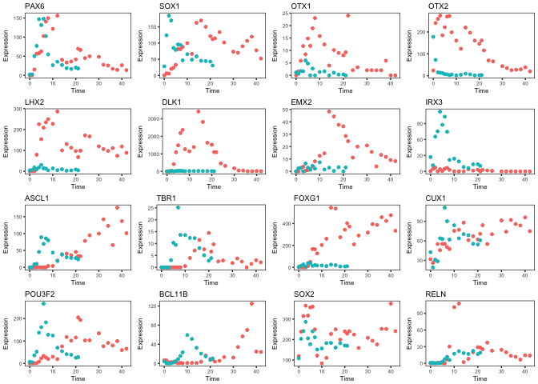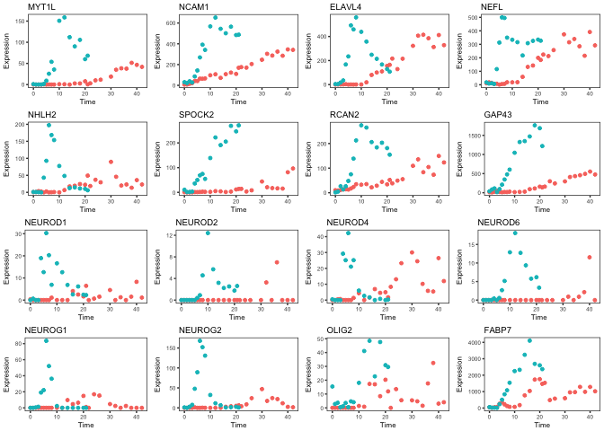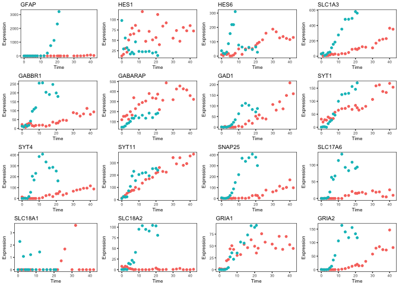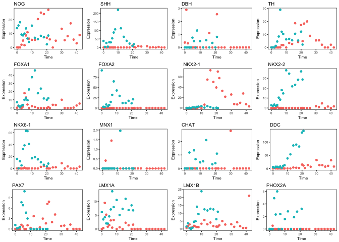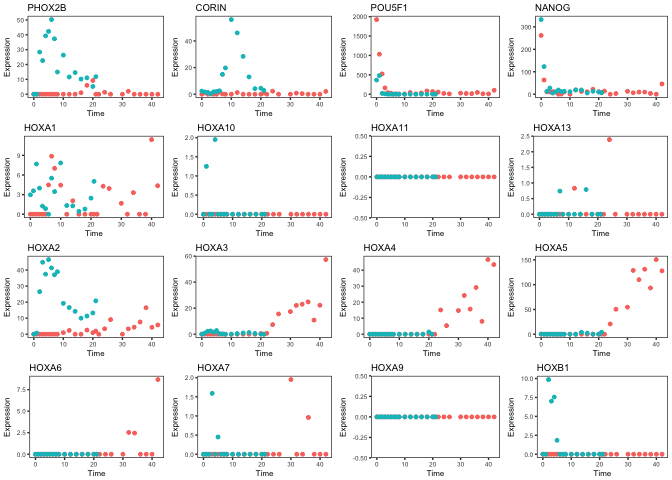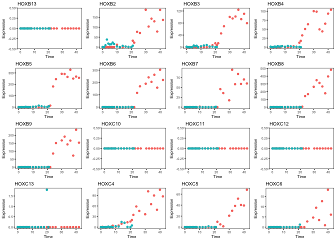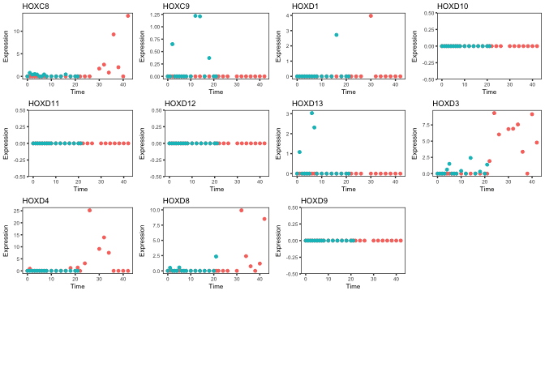

``` r
pdf("~/Desktop/ChosenGenes.pdf", onefile = TRUE)
grid.draw(legend) 
marrangeGrob(grobs=plotlist , nrow=4, ncol=4,top = NULL)
```

``` r
dev.off()
```

    ## quartz_off_screen 
    ##                 2

We can also graph the gene expression over time, averaging replicates (There are no replicates in this time series, but we can pretend there are for one timepoint just to see error bars)

### Plotting together, averaging timepoints

``` r
#You can string together as many datasets as you as you want!
conditionsMerged <- c(conditionsH,conditionsM)
tpMerged <- c(tpsH,tpsM)
dataMerged <- rn.merge(hTPMs,mTPMs)
ggg <- NULL

###GET RID OF THESE 3 LINES WHEN DOING REAL ANALYSIS
#pretend that the 3rd through the 5th tps are replicates
tpMerged <- tpMerged[c(1,2,3,3,3,4:length(tpMerged))]
conditionsMerged <- conditionsMerged[c(1,2,3,3,3,4:length(conditionsMerged))]
dataMerged <- dataMerged[,c(1,2,3,4,5,4:ncol(dataMerged))]

gene_list <- neuralList[neuralList%in%rownames(dataMerged)]

if(length(tpMerged)!=length(conditionsMerged))stop("You need to have the same number of conditions and time points")

plotlist <- lapply( gene_list,function(gn){
  #Calculate mean values
  meanGenes <- sapply(unique(conditionsMerged),function(x){
    #get the row for the current gene in the outer loop, with all the samples from condition x
    #take the mean if the timepoint matches
    tst <- aggregate(dataMerged[gn,conditionsMerged==x], list(tpMerged[conditionsMerged==x]), mean)
    zoo(tst[,2],tst[,1])
      })
  ds <- Reduce(merge.zoo,meanGenes)
  colnames(ds) <- unique(conditionsMerged)
  ds <- data.frame(ds)
  ds <- cbind("tme"=rownames(ds) , ds)
  melted <-  melt(ds)
  #calculate standard errors
  seGenes <- sapply(unique(conditionsMerged),function(x){
    tst <- aggregate(dataMerged[gn,conditionsMerged==x], list(tpMerged[conditionsMerged==x]), function(q)sd(q)/sqrt(length(q)))
    zoo(tst[,2],tst[,1])
  })
  seGenes <- Reduce(merge.zoo,seGenes)
  colnames(seGenes) <-unique(conditionsMerged)
  seGenes <- as.data.frame(seGenes)
  seGenes <- cbind("tme"=rownames(seGenes) , seGenes)
  meltSE <-  melt(seGenes)
  melted <-  cbind(melted,"se"= meltSE$value)
  melted$tme <- as.numeric(as.character(melted$tme))
  #Plotting Error Bars
  pd <- position_dodge(0.5) # move them .05 to the left and right
  
  gg <-  ggplot(melted, aes(x=tme, y=value, group=variable,color=variable)) + 
    geom_errorbar(aes(ymin=value-se, ymax=value+se), width=.03, position=pd) +
    geom_line(position=pd,size=.4) +
    geom_point(position=pd,size=.8) +
    theme_bw(base_size = 6) +
    theme(legend.position="none",
          panel.grid.major = element_blank(),
          panel.grid.minor = element_blank(),
          panel.background = element_blank())+
  #scale_x_continuous(expand = c(0, 0)) + scale_y_continuous(expand = c(0, 0))+
    labs(x = "Time", y = "Expression", 
         title = gn,family="arial",size=6)
  gg
  ggg<<-gg 
})

legend <- g_legend(ggg+theme(legend.position="left",
          panel.grid.major = element_blank(),
          panel.grid.minor = element_blank(),
          panel.background = element_blank())) 
grid.draw(legend) 
```


``` r
marrangeGrob(grobs=plotlist , nrow=4, ncol=4,top = NULL)
```

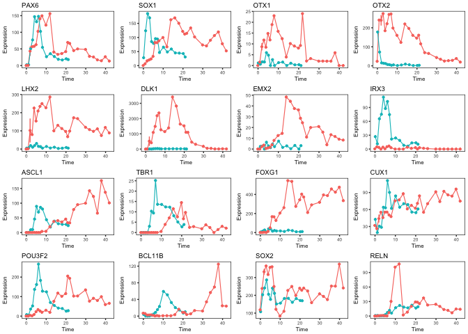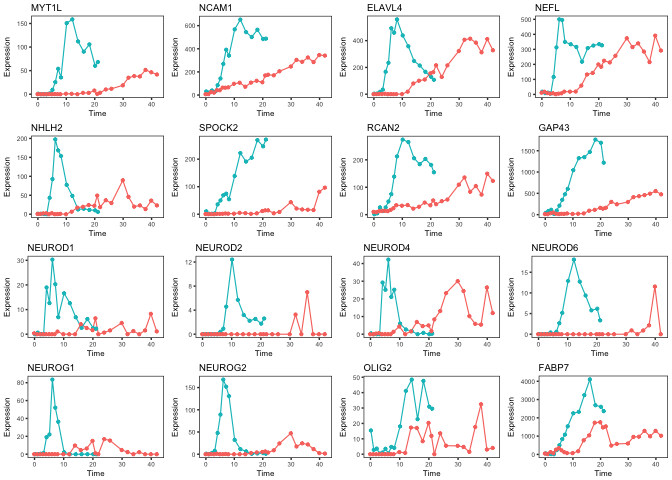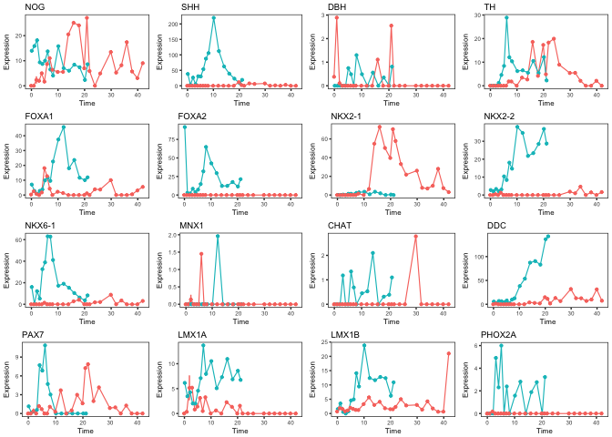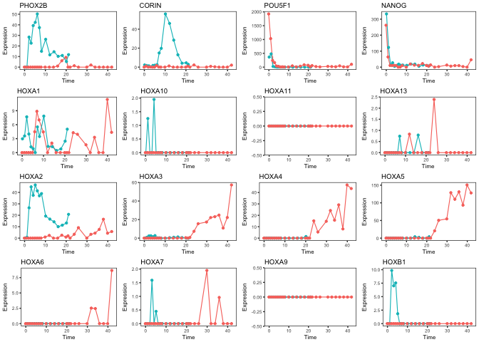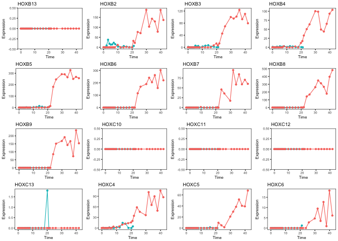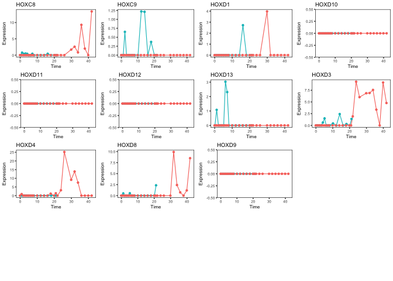

``` r
#output this whole list of plots as a PDF on your desktop
pdf("~/Desktop/ChosenMeanGenes.pdf", onefile = TRUE)
grid.draw(legend) 
marrangeGrob(grobs=plotlist , nrow=4, ncol=4,top = NULL)
```

``` r
dev.off()
```

    ## quartz_off_screen 
    ##                 2
